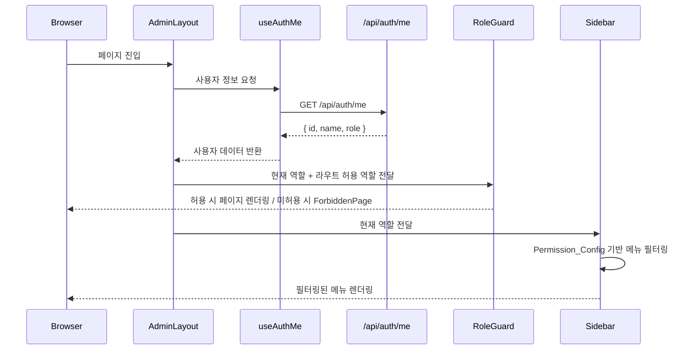

# Design Document: admin-role-based-menu

## Overview

SoFit admin-front에 역할 기반 메뉴/접근 제어 시스템을 구현한다. 현재 모든 관리자가 동일한 사이드바를 보는 구조에서, ADMIN_DEV / ADMIN_BANK_TELLER / ADMIN_BANK_MANAGER 세 역할에 따라 메뉴를 필터링하고, 권한 없는 경로 접근을 차단하는 구조로 전환한다.

핵심 설계 원칙:
- **중앙 집중 권한 설정**: Permission_Config 단일 객체로 메뉴-역할 매핑 관리
- **선언적 라우트 가드**: RoleGuard 컴포넌트로 라우트별 접근 제어
- **React Query 기반 인증 상태**: useAuthMe 훅으로 서버 상태 조회, Zustand에 중복 저장하지 않음
- **새 페이지는 placeholder만**: 실제 콘텐츠는 별도 스펙에서 구현

## Architecture

```mermaid
graph TD
    subgraph "인증 흐름"
        A[App 진입] --> B{useAuthMe 쿼리}
        B -->|성공| C[역할 정보 획득]
        B -->|실패/401| D[/login 리다이렉트]
        C --> E{역할 유효성 검증}
        E -->|유효| F[정상 렌더링]
        E -->|무효| D
    end

    subgraph "접근 제어 흐름"
        F --> G[RoleGuard 컴포넌트]
        G -->|역할 허용| H[페이지 렌더링]
        G -->|역할 미허용| I[ForbiddenPage]
    end

    subgraph "사이드바 필터링"
        C --> J[Permission_Config 조회]
        J --> K[역할별 메뉴 필터링]
        K --> L[Sidebar 렌더링]
    end
```

### 데이터 흐름



## Components and Interfaces

### 1. Permission_Config (`src/constants/permissions.ts`)

역할별 메뉴 접근 권한을 정의하는 중앙 설정 객체.

```typescript
// 역할 타입 정의
type AdminRole = 'ADMIN_DEV' | 'ADMIN_BANK_TELLER' | 'ADMIN_BANK_MANAGER';

// 메뉴 항목 설정
interface MenuItemConfig {
  key: string;
  label: string;
  path: string;
  allowedRoles: AdminRole[];
}

// 메뉴 그룹 설정
interface MenuGroupConfig {
  category: string;
  items: MenuItemConfig[];
}

// 역할 표시명 매핑
const ROLE_DISPLAY_NAMES: Record<AdminRole, string>;

// 라우트별 허용 역할 매핑
const ROUTE_PERMISSIONS: Record<string, AdminRole[]>;

// 메뉴 그룹 설정
const MENU_CONFIG: MenuGroupConfig[];
```

### 2. useAuthMe 훅 (`src/hooks/useAuthMe.ts`)

React Query 기반 사용자 정보 조회 커스텀 훅.

```typescript
interface AuthMeResponse {
  id: number;
  name: string;
  role: AdminRole;
}

function useAuthMe(): {
  data: AuthMeResponse | undefined;
  isLoading: boolean;
  isError: boolean;
  error: Error | null;
}
```

- queryKey: `AUTH_KEYS.me` (기존 정의 활용)
- staleTime: 5분 (기존 QueryClient 설정 활용)
- retry: 1회 (기존 설정)
- 401 응답 시 axiosInstance 인터셉터에서 /login 리다이렉트 처리

### 3. RoleGuard 컴포넌트 (`src/components/common/RoleGuard.tsx`)

라우트 레벨 접근 제어 컴포넌트.

```typescript
interface RoleGuardProps {
  allowedRoles: AdminRole[];
  children: React.ReactNode;
}

function RoleGuard({ allowedRoles, children }: RoleGuardProps): JSX.Element;
```

동작:
- useAuthMe로 현재 사용자 역할 조회
- 로딩 중: 로딩 스피너 표시
- 에러/미인증: /login 리다이렉트
- 역할 미허용: ForbiddenPage 렌더링
- 역할 허용: children 렌더링

### 4. ForbiddenPage (`src/pages/error/ForbiddenPage.tsx`)

403 권한 없음 페이지.

```typescript
function ForbiddenPage(): JSX.Element;
```

- "접근 권한이 없습니다" 메시지 표시
- "대시보드로 이동" 버튼 (항상 /dashboard로 이동)
- "이전 페이지" 버튼 (히스토리 존재 시 history.back(), 없으면 /dashboard)

### 5. Sidebar 리팩토링 (`src/components/common/Sidebar.tsx`)

기존 하드코딩된 MENU_GROUPS를 Permission_Config 기반 필터링으로 교체.

```typescript
function Sidebar(): JSX.Element;
// - useAuthMe로 현재 사용자 역할/이름 조회
// - getFilteredMenuGroups(role) 유틸로 메뉴 필터링
// - 사용자 이름 + 역할 한글 표시명 렌더링
```

### 6. 메뉴 필터링 유틸 (`src/utils/menuFilter.ts`)

```typescript
function getFilteredMenuGroups(role: AdminRole): MenuGroupConfig[];
// - MENU_CONFIG에서 각 그룹의 items를 역할 기준으로 필터링
// - items가 0개인 그룹은 제거
// - 필터링된 MenuGroupConfig[] 반환
```

### 7. Placeholder 페이지들

| 페이지 | 경로 | 파일 |
|--------|------|------|
| ReviewHistoryPage | /review-history | `src/pages/placeholder/ReviewHistoryPage.tsx` |
| ManagerApprovalPage | /manager-approval | `src/pages/placeholder/ManagerApprovalPage.tsx` |
| LoanDetailPage | /loan/:id | `src/pages/placeholder/LoanDetailPage.tsx` |

각 placeholder는 페이지 제목만 표시하는 최소 컴포넌트.

### 8. 라우터 구조 확장 (`src/router/routes.tsx`)

```typescript
// RoleGuard를 각 라우트에 적용
{
  path: "/",
  element: <AdminLayout />,
  children: [
    { index: true, element: <Navigate to="/dashboard" replace /> },
    { path: "dashboard", element: <RoleGuard allowedRoles={ALL_ROLES}><DashboardPage /></RoleGuard> },
    { path: "review-history", element: <RoleGuard allowedRoles={[...]}><ReviewHistoryPage /></RoleGuard> },
    { path: "manager-approval", element: <RoleGuard allowedRoles={[...]}><ManagerApprovalPage /></RoleGuard> },
    { path: "loan/:id", element: <RoleGuard allowedRoles={[...]}><LoanDetailPage /></RoleGuard> },
    // ... 기존 라우트에도 RoleGuard 적용
    { path: "*", element: <Navigate to="/dashboard" replace /> },
  ],
}
```

## Data Models

### AuthMeResponse

```typescript
interface AuthMeResponse {
  id: number;
  name: string;
  role: AdminRole;
}
```

서버 `/api/auth/me` 응답 형태. React Query 캐시에 저장되며, queryKey `["auth", "me"]`로 앱 전역에서 접근 가능.

### AdminRole

```typescript
type AdminRole = 'ADMIN_DEV' | 'ADMIN_BANK_TELLER' | 'ADMIN_BANK_MANAGER';

const VALID_ROLES: AdminRole[] = ['ADMIN_DEV', 'ADMIN_BANK_TELLER', 'ADMIN_BANK_MANAGER'];
```

### MenuItemConfig

```typescript
interface MenuItemConfig {
  key: string;           // 고유 식별자 (예: 'loan-applications')
  label: string;         // 표시 텍스트 (예: '대출 신청 현황')
  path: string;          // 라우트 경로 (예: '/dashboard')
  allowedRoles: AdminRole[];  // 접근 허용 역할 목록
}
```

### MenuGroupConfig

```typescript
interface MenuGroupConfig {
  category: string;      // 카테고리명 (예: '대출')
  items: MenuItemConfig[];
}
```

### Permission_Config 데이터

```typescript
const MENU_CONFIG: MenuGroupConfig[] = [
  {
    category: '대출',
    items: [
      { key: 'loan-applications', label: '대출 신청 현황', path: '/dashboard', allowedRoles: ['ADMIN_DEV', 'ADMIN_BANK_TELLER', 'ADMIN_BANK_MANAGER'] },
      { key: 'review-history', label: '심사 내역 조회', path: '/review-history', allowedRoles: ['ADMIN_DEV', 'ADMIN_BANK_TELLER', 'ADMIN_BANK_MANAGER'] },
      { key: 'manager-approval', label: '지점장 결재', path: '/manager-approval', allowedRoles: ['ADMIN_DEV', 'ADMIN_BANK_MANAGER'] },
    ],
  },
  {
    category: '관리',
    items: [
      { key: 'users', label: '고객 관리', path: '/users', allowedRoles: ['ADMIN_DEV', 'ADMIN_BANK_TELLER', 'ADMIN_BANK_MANAGER'] },
    ],
  },
  {
    category: '시스템',
    items: [
      { key: 'api-logs', label: 'API 로그', path: '/api-logs', allowedRoles: ['ADMIN_DEV'] },
      { key: 'batch', label: 'S등급 배치 관리', path: '/batch', allowedRoles: ['ADMIN_DEV'] },
    ],
  },
];
```

## Correctness Properties

*A property is a characteristic or behavior that should hold true across all valid executions of a system—essentially, a formal statement about what the system should do. Properties serve as the bridge between human-readable specifications and machine-verifiable correctness guarantees.*

### Property 1: 잘못된 역할 값 거부

*For any* 문자열이 'ADMIN_DEV', 'ADMIN_BANK_TELLER', 'ADMIN_BANK_MANAGER' 중 하나가 아닌 경우, 역할 유효성 검증 함수는 해당 값을 거부(false 반환)해야 한다.

**Validates: Requirements 1.5**

### Property 2: 역할별 메뉴 필터링 정확성

*For any* 유효한 역할(AdminRole)에 대해, getFilteredMenuGroups 함수가 반환하는 모든 메뉴 항목의 allowedRoles 배열은 해당 역할을 포함해야 하며, Permission_Config에서 해당 역할을 포함하는 모든 메뉴 항목이 결과에 포함되어야 한다.

**Validates: Requirements 2.1, 3.5**

### Property 3: Permission_Config 구조 불변 조건

*For any* MENU_CONFIG 내의 메뉴 항목에 대해, allowedRoles 배열은 최소 1개 이상의 유효한 AdminRole 값을 포함해야 한다.

**Validates: Requirements 3.1**

### Property 4: 권한 없는 경로 접근 차단

*For any* 유효한 역할과 해당 역할의 allowedRoles에 포함되지 않는 경로 조합에 대해, RoleGuard는 children을 렌더링하지 않고 ForbiddenPage를 렌더링해야 한다.

**Validates: Requirements 3.4, 4.1, 5.5**

### Property 5: 미인증 사용자 리다이렉트

*For any* 인증이 필요한 경로에 대해, 미인증 상태(useAuthMe 에러)에서 접근 시 /login 경로로 리다이렉트해야 한다.

**Validates: Requirements 4.6, 5.6**

### Property 6: 정의되지 않은 경로 리다이렉트

*For any* 라우터에 정의되지 않은 경로 문자열에 대해, 앱은 /dashboard로 리다이렉트해야 한다.

**Validates: Requirements 5.7**

## Error Handling

| 상황 | 처리 방식 |
|------|-----------|
| /api/auth/me 401 응답 | axiosInstance 인터셉터에서 /login 리다이렉트 |
| /api/auth/me 네트워크 에러 | useAuthMe isError → /login 리다이렉트 |
| 응답의 role 값이 유효하지 않음 | isValidRole() 검증 실패 → /login 리다이렉트 |
| 인증된 사용자가 권한 없는 경로 접근 | RoleGuard → ForbiddenPage 렌더링 |
| 미인증 사용자가 보호된 경로 접근 | RoleGuard → /login 리다이렉트 |
| 정의되지 않은 경로 접근 | catch-all 라우트 → /dashboard 리다이렉트 |
| useAuthMe 로딩 중 | 로딩 스피너 표시 (깜빡임 방지) |

### 에러 처리 설계 결정

- **401 처리 이중화**: axiosInstance 인터셉터(전역)와 RoleGuard(라우트 레벨) 모두에서 처리. 인터셉터는 모든 API 호출에 대한 안전망, RoleGuard는 페이지 진입 시점의 명시적 가드.
- **역할 유효성 검증**: 서버 응답을 신뢰하되, 프론트엔드에서도 타입 가드로 방어적 검증 수행.
- **로딩 상태**: useAuthMe 로딩 중에는 빈 화면 대신 로딩 인디케이터를 표시하여 UX 개선.

## Testing Strategy

### 단위 테스트 (Vitest + React Testing Library)

| 대상 | 테스트 내용 |
|------|------------|
| `isValidRole()` | 유효/무효 역할 값 검증 |
| `getFilteredMenuGroups()` | 각 역할별 필터링 결과 확인 |
| `Permission_Config` | 설정 데이터 구조 검증 |
| `RoleGuard` | 역할 허용/미허용/미인증 시 렌더링 확인 |
| `ForbiddenPage` | 메시지, 버튼 존재 확인 |
| `Sidebar` | 역할별 메뉴 렌더링 확인 |

### Property-Based 테스트 (fast-check)

Property-based testing 라이브러리로 `fast-check`을 사용한다.

- 최소 100회 반복 실행
- 각 테스트에 설계 문서의 property 번호를 태그로 명시
- 태그 형식: `Feature: admin-role-based-menu, Property {number}: {property_text}`

**Property 테스트 대상:**
1. `isValidRole()` — 임의의 문자열에 대한 유효성 검증 (Property 1)
2. `getFilteredMenuGroups()` — 임의의 유효 역할에 대한 필터링 정확성 (Property 2)
3. `MENU_CONFIG` 구조 검증 — 모든 항목의 allowedRoles 비어있지 않음 (Property 3)
4. `RoleGuard` 접근 제어 로직 — 역할-경로 조합에 대한 차단 동작 (Property 4)

**Example 테스트 대상:**
- 각 역할별 구체적 메뉴 목록 확인 (Requirements 2.2, 2.3, 2.4)
- ForbiddenPage UI 요소 확인 (Requirements 4.2, 4.3)
- 라우트 매핑 확인 (Requirements 5.1, 5.2, 5.3)
- 역할 한글 표시명 매핑 (Requirements 2.5)

### 테스트 환경 설정

- `fast-check` 패키지 devDependencies에 추가
- 테스트 파일 위치: `src/__tests__/` 디렉토리
- React Query 테스트: `@tanstack/react-query` 의 `QueryClientProvider` wrapper 활용
- React Router 테스트: `MemoryRouter` 활용
