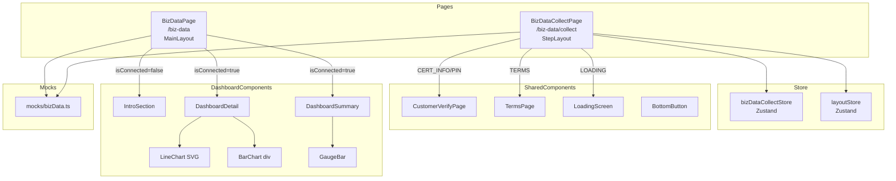
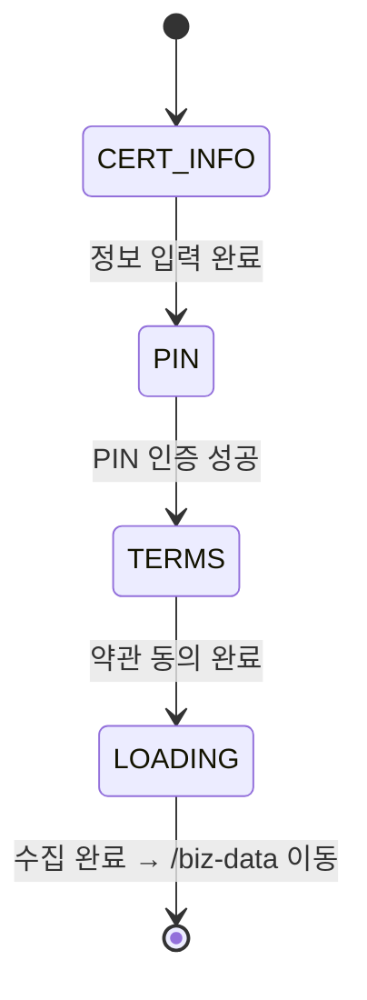

# Design Document: 마이 비즈 데이터 UI 구현

## Overview

마이 비즈 데이터(My Biz Data) 페이지 UI를 구현한다. 기존 LoanApplyPage 패턴(Zustand store + switch문 step 렌더링)을 그대로 따르며, 공통 컴포넌트(CustomerVerifyPage, TermsPage, LoadingScreen, BottomButton)를 재사용한다.

주요 구현 범위:
- **BizDataPage** (`/biz-data`): 미연결 소개 화면 + 연결완료 대시보드
- **BizDataCollectPage** (`/biz-data/collect`): step 기반 수집 흐름 (CERT_INFO → PIN → TERMS → LOADING)
- **LoadingScreen**: 기존 인터페이스에 onComplete prop 추가 + 자동 전환 로직 구현
- **Mock 데이터**: `mocks/bizData.ts`에서 모든 mock 데이터 관리

recharts 미설치 상태이므로 차트는 SVG(라인차트) + div(바차트)로 직접 구현한다.

## Architecture



### Step 흐름 상태 다이어그램



## Components and Interfaces

### 1. BizDataCollectStore (`stores/bizDataCollectStore.ts`)

```typescript
type BizDataCollectStep = 'CERT_INFO' | 'PIN' | 'TERMS' | 'LOADING';

interface BizDataCollectState {
  currentStep: BizDataCollectStep;
  setStep: (step: BizDataCollectStep) => void;
  nextStep: () => void;
  prevStep: () => void;
  reset: () => void;
}

const STEP_ORDER: BizDataCollectStep[] = ['CERT_INFO', 'PIN', 'TERMS', 'LOADING'];
```

### 2. BizDataPage (`pages/bizData/BizDataPage.tsx`)

- `MOCK_IS_CONNECTED` 플래그로 미연결/연결완료 분기
- 미연결: IntroSection + BottomButton("데이터 연결 시작하기")
- 연결완료: DashboardSummary + DashboardDetail

### 3. BizDataCollectPage (`pages/bizData/BizDataCollectPage.tsx`)

- LoanApplyPage 패턴 그대로 따름
- useEffect에서 `setStepTitle("마이 비즈 데이터")` + `setOnBack()` 설정
- switch(currentStep)으로 step별 컴포넌트 렌더링

### 4. LoadingScreen (`components/common/LoadingScreen.tsx`)

```typescript
interface LoadingScreenProps {
  title: string;
  description?: string;
  steps?: Array<{
    label: string;
    status: 'pending' | 'loading' | 'done';
  }>;
  onComplete?: () => void;
}
```

- steps 전달 시: 첫 항목 loading, 나머지 pending으로 시작
- 2초 간격으로 순차 전환 (pending → loading → done)
- 모든 항목 done 시 onComplete 1회 호출
- 언마운트 시 타이머 cleanup

### 5. 대시보드 서브컴포넌트 (`components/bizData/`)

| 컴포넌트 | 역할 |
|---------|------|
| IntroSection | 미연결 소개 (일러스트 + 혜택 카드 3개) |
| DashboardSummary | 매출 요약 + 업종 비교 게이지 |
| DashboardDetail | 차트 + 대출/리뷰/고객 카드 |
| RevenueLineChart | SVG 라인 차트 (매출 추이) |
| TransactionBarChart | div 바 차트 (입출금 흐름) |
| GaugeBar | 퍼센트 게이지 바 |
| RatingLineChart | SVG 라인 차트 (평점 추이) |

### 6. 유틸리티 함수

```typescript
// 천 단위 콤마 포맷팅
function formatCurrency(amount: number): string;

// 증감률 포맷팅 (+/-% 형식)
function formatChangeRate(rate: number): { text: string; isPositive: boolean };
```

## Data Models

### Mock 데이터 구조 (`mocks/bizData.ts`)

```typescript
import type { TermsItem } from '@/types/common';

// 연결 상태 플래그
export const MOCK_IS_CONNECTED: boolean = true;

// 약관 데이터 (5개: 필수 4 + 선택 1)
export const MOCK_BIZ_DATA_TERMS: TermsItem[];

// 수집 단계 (6개 항목)
export const MOCK_BIZ_DATA_COLLECT_STEPS: Array<{
  label: string;
  status: 'pending' | 'loading' | 'done';
}>;

// 대시보드 데이터
export interface BizDashboardData {
  currentMonth: string;              // "2025.01"
  monthlyRevenue: number;            // 이번 달 매출
  monthOverMonthChange: number;      // 전월 대비 변동률 (%)
  cashFlow: number;                  // 현금 흐름
  netProfit: number;                 // 순이익 (추정)
  industryComparison: {
    industryName: string;            // 업종명
    revenue: number;                 // 매출 상위 %
    profitability: number;           // 수익성 상위 %
    stability: number;               // 안정성 상위 %
  };
  revenueTrend: Array<{             // 5개월분
    month: string;
    amount: number;
  }>;
  transactionFlow: Array<{          // 3개월분
    month: string;
    income: number;
    expense: number;
  }>;
  loanBalance: number;              // 대출 잔액
  loanRepaymentDate: string;        // 상환일
  review: {
    averageRating: number;          // 평균 평점
    reviewCount: number;            // 리뷰 수
    ratingTrend: Array<{            // 평점 추이
      month: string;
      rating: number;
    }>;
  };
  customerRatio: {
    repurchaseRate: number;         // 재구매율 (%)
    recommendCount: number;        // 추천 건수
  };
}

export const MOCK_BIZ_DASHBOARD: BizDashboardData;
```

## Correctness Properties

*A property is a characteristic or behavior that should hold true across all valid executions of a system—essentially, a formal statement about what the system should do. Properties serve as the bridge between human-readable specifications and machine-verifiable correctness guarantees.*

### Property 1: Store step 전환 일관성

*For any* 유효한 BizDataCollectStep에서 nextStep을 호출하면, currentStep은 STEP_ORDER 배열에서 현재 인덱스의 다음 인덱스 값이어야 하며, 마지막 step에서는 변경되지 않아야 한다. 마찬가지로 prevStep을 호출하면 이전 인덱스 값이어야 하며, 첫 번째 step에서는 변경되지 않아야 한다.

**Validates: Requirements 2.1**

### Property 2: LoadingScreen 순차 전환 및 완료 콜백

*For any* 1개 이상의 step 배열이 주어졌을 때, LoadingScreen은 2초 간격으로 순차적으로 각 항목을 pending → loading → done으로 전환하며, 모든 항목이 done이 된 후 onComplete 콜백을 정확히 1회 호출해야 한다.

**Validates: Requirements 6.3, 6.4**

### Property 3: 금액 포맷팅 정확성

*For any* 0 이상의 정수 금액에 대해, formatCurrency 함수는 3자리마다 콤마를 삽입한 문자열을 반환해야 하며, 파싱하여 원래 숫자로 복원할 수 있어야 한다 (round-trip).

**Validates: Requirements 7.3, 7.4**

### Property 4: 게이지 바 너비 비례

*For any* 0에서 100 사이의 퍼센트 값에 대해, GaugeBar 컴포넌트의 채움 영역 너비는 해당 퍼센트 값에 정확히 비례해야 한다 (width style이 `${percent}%`).

**Validates: Requirements 7.5**

## Error Handling

| 상황 | 처리 방식 |
|------|----------|
| PIN 인증 실패 | CustomerVerifyPage 내부에서 에러 메시지 표시 + PIN 초기화 (기존 구현) |
| LoadingScreen 언마운트 | useEffect cleanup에서 타이머(setTimeout/setInterval) 정리 |
| 잘못된 step 값 | switch default에서 null 반환 (방어적 처리) |
| Mock 데이터 타입 불일치 | TypeScript strict 모드에서 컴파일 타임 검출 |
| 네비게이션 실패 | react-router-dom의 기본 에러 처리에 위임 |

## Testing Strategy

### 단위 테스트 (Vitest + React Testing Library)

1. **BizDataCollectStore 테스트**
   - nextStep/prevStep/setStep/reset 동작 확인
   - 경계 조건 (첫/마지막 step에서의 prev/next)

2. **LoadingScreen 테스트**
   - 초기 렌더링 상태 확인
   - 타이머 기반 순차 전환 (vi.useFakeTimers)
   - onComplete 콜백 호출 확인
   - 언마운트 시 cleanup 확인
   - steps 미전달 시 동작

3. **BizDataPage 테스트**
   - isConnected=false: 소개 화면 렌더링
   - isConnected=true: 대시보드 렌더링
   - 네비게이션 동작

4. **BizDataCollectPage 테스트**
   - step별 올바른 컴포넌트 렌더링
   - layoutStore 설정/해제
   - 뒤로가기 동작

5. **유틸리티 함수 테스트**
   - formatCurrency: 다양한 금액 포맷팅
   - formatChangeRate: 양수/음수/0 처리

### Property-Based 테스트 (fast-check)

- 라이브러리: `fast-check` (TypeScript 네이티브 PBT 라이브러리)
- 최소 100회 반복
- 각 테스트에 설계 문서 property 참조 태그 포함

**태그 형식:** `Feature: biz-data-ui, Property {number}: {property_text}`

| Property | 테스트 대상 | 생성 전략 |
|----------|-----------|----------|
| 1 | bizDataCollectStore | 임의의 STEP_ORDER 인덱스 생성 |
| 2 | LoadingScreen | 1~10개 임의 step 배열 생성 + fake timer |
| 3 | formatCurrency | fc.nat() (0 이상 정수) |
| 4 | GaugeBar | fc.integer({min:0, max:100}) |

### 통합 테스트

- 전체 수집 흐름 (CERT_INFO → PIN → TERMS → LOADING → 네비게이션)
- 대시보드 데이터 바인딩 (mock 데이터 → UI 렌더링)
