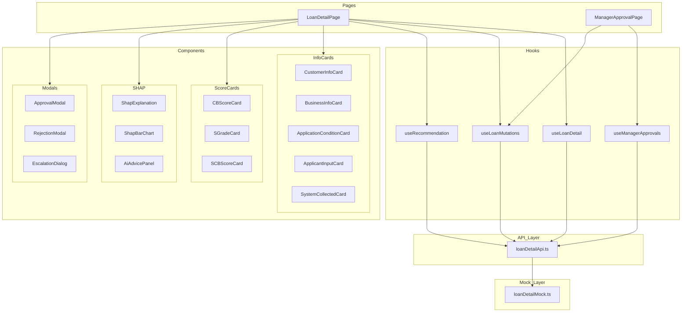

# Design Document: 대출 신청 상세 페이지

## Overview

대출 신청 상세 페이지(`/loan/:id`)와 지점장 결재 페이지(`/manager-approval`)를 구현합니다. 은행원(ADMIN_BANK_TELLER)은 대출 신청 건의 상세 정보를 확인하고 승인/거절/추가 결재 요청을 처리하며, 지점장(ADMIN_BANK_MANAGER)은 추가 결재 요청된 건을 승인/거절 처리합니다.

주요 기능:
- 고객 기본 정보, 사업자 정보, 신청 조건, 신청자 입력 정보 카드 표시
- 시스템 수집 정보(마이비즈데이터) 카드 표시 (재무 현황, 운영 신뢰도, 시장 포지션)
- CB 신용점수, 성장S등급, SCB 점수 시각적 게이지 표시
- SHAP 기반 특성 영향력 바 차트 + AI 자연어 해석 표시
- 대출 승인/거절 모달 처리
- 추가 결재 요청 다이얼로그
- 지점장 결재 목록 및 결재 처리
- 역할 기반 접근 제어 및 버튼 표시 제어

기술 스택: React + TypeScript, Tailwind CSS, React Query (서버 상태), Zustand (클라이언트 상태), Vitest + React Testing Library, fast-check (PBT)

## Architecture




### 아키텍처 설계 결정

1. **Mock-first 접근**: 실제 API 연동 전까지 `src/mocks/loanDetailMock.ts`에서 데이터를 반환하고, `src/api/loanDetailApi.ts`에서 mock 함수를 호출. 향후 axiosInstance 호출로 교체
2. **React Query 기반 서버 상태**: 상세 데이터, SHAP 결과, 추천값 조회 모두 React Query로 관리하여 캐싱, 로딩/에러 상태를 일관되게 처리
3. **useMutation 기반 액션 처리**: 승인/거절/추가결재 요청은 useMutation으로 처리하고, 성공 시 관련 queryKey를 invalidate
4. **컴포넌트 분리**: 정보 카드, 점수 카드, SHAP 영역, 모달을 각각 독립 컴포넌트로 분리하여 단일 책임 원칙 준수
5. **역할 기반 버튼 렌더링**: RoleGuard는 라우트 레벨 접근 제어, 페이지 내부에서는 useAuthMe로 역할 확인하여 버튼 표시/비활성화 제어

### 디렉토리 구조

```
admin-front/src/
├── pages/
│   ├── loan-detail/
│   │   └── LoanDetailPage.tsx
│   └── manager-approval/
│       └── ManagerApprovalPage.tsx
├── components/
│   └── loan-detail/
│       ├── HeaderSection.tsx
│       ├── CustomerInfoCard.tsx
│       ├── BusinessInfoCard.tsx
│       ├── ApplicationConditionCard.tsx
│       ├── ApplicantInputCard.tsx
│       ├── SystemCollectedCard.tsx
│       ├── CBScoreCard.tsx
│       ├── SGradeCard.tsx
│       ├── SCBScoreCard.tsx
│       ├── ShapExplanation.tsx
│       ├── ShapBarChart.tsx
│       ├── AiAdvicePanel.tsx
│       ├── ApprovalModal.tsx
│       ├── RejectionModal.tsx
│       └── EscalationDialog.tsx
├── hooks/
│   ├── useLoanDetail.ts
│   ├── useRecommendation.ts
│   ├── useManagerApprovals.ts
│   └── useLoanMutations.ts
├── api/
│   └── loanDetailApi.ts
├── mocks/
│   └── loanDetailMock.ts
├── utils/
│   ├── formatters.ts
│   ├── validators.ts
│   └── actionButtons.ts
└── types/
    └── index.ts (기존 파일에 타입 추가)
```


## Components and Interfaces

### 페이지 컴포넌트

#### LoanDetailPage (`src/pages/loan-detail/LoanDetailPage.tsx`)
- URL 파라미터 `:id`로 대출 신청 건 ID를 받아 상세 데이터 조회
- `Number(id)` 변환 후 NaN이면 404 처리
- 로딩/에러/404 상태 처리
- 역할과 심사 상태에 따른 액션 버튼 렌더링
- 4열 → 전체너비 → 3열 → 전체너비 레이아웃 구성

#### ManagerApprovalPage (`src/pages/manager-approval/ManagerApprovalPage.tsx`)
- MANAGER_REVIEW 상태인 건 목록을 테이블로 표시
- 각 건의 상세보기 링크 제공
- 로딩/에러/빈 목록 상태 처리

### 정보 카드 컴포넌트

| 컴포넌트 | Props | 역할 |
|---------|-------|------|
| CustomerInfoCard | `data: CustomerInfo` | 고객 기본 정보 (마스킹 포함) |
| BusinessInfoCard | `data: BusinessInfo` | 사업자 정보 |
| ApplicationConditionCard | `data: ApplicationCondition` | 신청 조건 |
| ApplicantInputCard | `data: ApplicantInput` | 신청자 입력 정보 |
| SystemCollectedCard | `data: SystemCollectedData \| null` | 마이비즈데이터 3섹션 |

### 점수 카드 컴포넌트

| 컴포넌트 | Props | 역할 |
|---------|-------|------|
| CBScoreCard | `score: number \| null` | CB 신용점수 게이지 |
| SGradeCard | `grade: string \| null` | 성장S등급 수평 스케일 |
| SCBScoreCard | `scbScore, cbScore, grade, bonusPoints` | SCB 점수 게이지 바 |

### SHAP 컴포넌트

| 컴포넌트 | Props | 역할 |
|---------|-------|------|
| ShapExplanation | `data, isLoading, isError, onRetry` | SHAP 전체 영역 |
| ShapBarChart | `strengthDetails, improvementDetails` | 강점/개선 수평 바 차트 |
| AiAdvicePanel | `advice: string \| null` | AI 분석 요약 텍스트 |

### 모달 컴포넌트

| 컴포넌트 | Props | 역할 |
|---------|-------|------|
| ApprovalModal | `isOpen, onClose, applicationId, onSuccess` | 승인 처리 (추천값 + 수정 필드) |
| RejectionModal | `isOpen, onClose, applicationId, onSuccess` | 거절 처리 (사유 + 의견) |
| EscalationDialog | `isOpen, onClose, applicationId, onSuccess` | 추가 결재 요청 확인 |


### 커스텀 훅

| 훅 | 타입 | 역할 |
|---|---|---|
| `useLoanDetail(id)` | useQuery | 상세 데이터 조회, staleTime 30초 |
| `useRecommendation(id, enabled)` | useQuery | 모달 열릴 때만 추천값 조회 |
| `useManagerApprovals()` | useQuery | 결재 목록 조회 |
| `useLoanMutations(id)` | useMutation 모음 | approve, reject, escalate, managerApprove, managerReject |

### API 함수 (`src/api/loanDetailApi.ts`)

```typescript
export async function fetchLoanDetail(id: number): Promise<LoanDetailData | undefined>
export async function fetchRecommendation(id: number): Promise<RecommendationData>
export async function approveLoan(id: number, payload: ApprovalPayload): Promise<void>
export async function rejectLoan(id: number, payload: RejectionPayload): Promise<void>
export async function requestEscalation(id: number, payload: EscalationPayload): Promise<void>
export async function fetchManagerApprovals(): Promise<ManagerApprovalItem[]>
export async function managerApproveLoan(id: number, payload: ApprovalPayload): Promise<void>
export async function managerRejectLoan(id: number, payload: RejectionPayload): Promise<void>
```

### 유틸리티 함수

**formatters.ts**:
```typescript
export function maskResidentNumber(value: string): string   // "YYMMDD-N******"
export function formatPhone(value: string): string          // "010-XXXX-XXXX"
export function formatBusinessNumber(value: string): string // "XXX-XX-XXXXX"
export function formatAmount(value: number): string         // "N,NNN만원"
export function formatBusinessAge(months: number): string   // "N년 N개월"
export function formatGrowthRate(rate: number): string      // "+N.N%" / "-N.N%"
export function formatRankPercent(rank: number): string     // "상위 N.N%"
export function displayValue(value: unknown): string        // null → "-"
```

**validators.ts**:
```typescript
export function validateApprovalAmount(value: number): boolean  // 10만~10억 정수
export function validateInterestRate(value: number): boolean    // 0.01~20.00
export function validateLoanTerm(value: number): boolean        // 1~360 정수
export function isWhitespaceOnly(value: string): boolean        // 공백만 여부
```

**actionButtons.ts**:
```typescript
export function getActionButtons(role: AdminRole, status: ReviewStatus): ActionButtonConfig[]
```


## Data Models

### 타입 정의 (`src/types/index.ts`에 추가)

```typescript
/** 상환 방식 */
export type RepaymentMethod = 'EQUAL_PRINCIPAL_INTEREST' | 'EQUAL_PRINCIPAL' | 'BULLET';

/** 소득 종류 */
export type IncomeType = 'SALARY' | 'BUSINESS' | 'OTHER';

/** 부가세 신고 상태 */
export type VatFilingStatus = 'FILED' | 'PENDING' | 'OVERDUE';

/** 보험 납부 상태 */
export type InsurancePaymentStatus = 'PAID' | 'PENDING' | 'OVERDUE';

/** 고객 기본 정보 */
export interface CustomerInfo {
  name: string | null;
  residentNumber: string | null;
  phoneNumber: string | null;
  registeredAt: string | null;
  loginId: string | null;
}

/** 사업자 정보 */
export interface BusinessInfo {
  businessName: string | null;
  businessNumber: string | null;
  industry: string | null;
  businessType: string | null;
  address: string | null;
  startDate: string | null;
}

/** 신청 조건 */
export interface ApplicationCondition {
  desiredAmount: number | null;
  loanTermMonths: number | null;
  repaymentMethod: RepaymentMethod | null;
  purpose: string | null;
}

/** 신청자 입력 정보 */
export interface ApplicantInput {
  annualIncome: number | null;
  creditScore: number | null;
  incomeType: IncomeType | null;
  existingLoanAmount: number | null;
}
```


```typescript
/** 시스템 수집 정보 (마이비즈데이터) */
export interface SystemCollectedData {
  annual_income: number;
  existing_loan_count: number;
  monthly_revenue: number;
  monthly_revenue_growth_rate: number;
  cash_flow: number;
  account_balance: number;
  business_age_months: number;
  vat_filing_status: VatFilingStatus;
  tax_overdue: boolean;
  insurance_payment_status: InsurancePaymentStatus;
  industry_sales_rank: number;
  industry_profit_rank: number;
}

/** SHAP 특성-값 쌍 */
export interface ShapDetail {
  featureName: string;
  shapValue: number;
}

/** SHAP 분석 결과 */
export interface ShapResult {
  grade: string;
  targetGrade: string;
  strengthKeywords: string[];
  improvementKeywords: string[];
  strengthDetails: ShapDetail[];
  improvementDetails: ShapDetail[];
  advice: string;
}

/** 대출 신청 상세 전체 데이터 */
export interface LoanDetailData {
  id: number;
  applicationDate: string;
  applicantName: string;
  businessName: string;
  productName: string;
  reviewStatus: ReviewStatus;
  assigneeName: string;
  customerInfo: CustomerInfo;
  businessInfo: BusinessInfo;
  applicationCondition: ApplicationCondition;
  applicantInput: ApplicantInput;
  systemCollectedData: SystemCollectedData | null;
  cbScore: number | null;
  sGrade: string | null;
  scbScore: number | null;
  bonusPoints: number | null;
  shapResult: ShapResult | null;
}

/** 시스템 추천값 */
export interface RecommendationData {
  approvedAmount: number;
  interestRate: number;
  loanTermMonths: number;
  repaymentMethod: RepaymentMethod;
}
```


```typescript
/** 승인 요청 페이로드 */
export interface ApprovalPayload {
  approvedAmount: number;
  interestRate: number;
  loanTermMonths: number;
  repaymentMethod: RepaymentMethod;
  comment?: string;
}

/** 거절 요청 페이로드 */
export interface RejectionPayload {
  reason: string;
  comment?: string;
}

/** 추가 결재 요청 페이로드 */
export interface EscalationPayload {
  comment?: string;
}

/** 지점장 결재 목록 항목 */
export interface ManagerApprovalItem {
  id: number;
  applicationDate: string;
  applicantName: string;
  businessName: string;
  requestedByName: string;
  desiredAmount: number;
}

/** 액션 버튼 설정 */
export interface ActionButtonConfig {
  key: string;
  label: string;
  variant: 'primary' | 'danger' | 'secondary';
  disabled: boolean;
  action: string;
}
```

### Query Key 확장 (`src/constants/queryKeys.ts`)

```typescript
export const LOAN_KEYS = {
  all: ["loans"] as const,
  list: () => [...LOAN_KEYS.all, "list"] as const,
  detail: (id: number) => [...LOAN_KEYS.all, "detail", id] as const,
  applications: () => [...LOAN_KEYS.all, "applications"] as const,
  application: (id: number) => [...LOAN_KEYS.all, "application", id] as const,
  recommendation: (id: number) => [...LOAN_KEYS.all, "recommendation", id] as const,
  managerApprovals: () => [...LOAN_KEYS.all, "manager-approvals"] as const,
} as const;
```


## Correctness Properties

*A property is a characteristic or behavior that should hold true across all valid executions of a system—essentially, a formal statement about what the system should do. Properties serve as the bridge between human-readable specifications and machine-verifiable correctness guarantees.*

### Property 1: 역할-상태 조합에 따른 액션 버튼 결정 규칙

*For any* (AdminRole, ReviewStatus) 조합에 대해, 버튼 표시/활성화 결정 함수는 다음 규칙을 만족해야 한다:
- ADMIN_DEV → 심사 처리 버튼 없음
- ADMIN_BANK_TELLER + UNDER_REVIEW → 승인, 거절, 추가결재 활성
- ADMIN_BANK_TELLER + MANAGER_REVIEW → 승인, 거절 활성 + 추가결재 비활성
- ADMIN_BANK_MANAGER + MANAGER_REVIEW → 결재승인, 결재거절 활성
- 모든 역할 + (APPROVED | REJECTED) → 모든 버튼 비활성 또는 미표시

**Validates: Requirements 1.4, 1.5, 19.3, 19.4, 19.6, 19.7**

### Property 2: 주민번호 마스킹 규칙

*For any* 유효한 주민번호 문자열(13자리 숫자)에 대해, `maskResidentNumber` 함수는 앞 6자리와 뒷자리 첫 1자리만 노출하고 나머지 6자리를 "******"으로 마스킹하여 "YYMMDD-N******" 형식의 문자열을 반환해야 한다.

**Validates: Requirements 2.2**

### Property 3: 전화번호 포맷팅 규칙

*For any* 11자리 숫자 문자열에 대해, `formatPhone` 함수는 "NNN-NNNN-NNNN" 형식(3-4-4 하이픈 구분)의 문자열을 반환해야 하며, 원본 숫자가 모두 보존되어야 한다.

**Validates: Requirements 2.3**


### Property 4: null/빈 값 대체 표시 규칙

*For any* null, undefined, 또는 빈 문자열 입력에 대해, `displayValue` 함수는 항상 "-"을 반환해야 하며, 유효한 값(비어있지 않은 문자열 또는 숫자)에 대해서는 원본 값의 문자열 표현을 반환해야 한다.

**Validates: Requirements 2.5, 3.4, 4.5, 5.6, 6.12**

### Property 5: 사업자등록번호 포맷팅 규칙

*For any* 10자리 숫자 문자열에 대해, `formatBusinessNumber` 함수는 "NNN-NN-NNNNN" 형식(3-2-5 하이픈 구분)의 문자열을 반환해야 하며, 원본 숫자가 모두 보존되어야 한다.

**Validates: Requirements 3.2**

### Property 6: 금액 포맷팅 라운드트립

*For any* 양의 정수에 대해, `formatAmount` 함수는 천 단위 콤마가 포함된 "N,NNN만원" 형식의 문자열을 반환해야 하며, 콤마를 제거하고 "만원"을 제거하면 원본 숫자와 동일해야 한다.

**Validates: Requirements 4.2, 5.3, 6.3**

### Property 7: 증감률 포맷팅 부호 보존

*For any* 실수에 대해, `formatGrowthRate` 함수는 양수일 때 "+N.N%" 형식을, 음수일 때 "-N.N%" 형식을 반환해야 하며, 부호와 수치가 원본 값과 일치해야 한다.

**Validates: Requirements 6.4**

### Property 8: 업력 포맷팅 라운드트립

*For any* 양의 정수(월 수)에 대해, `formatBusinessAge` 함수는 "N년 N개월" 형식을 반환해야 하며, 반환된 년×12 + 개월이 원본 월 수와 동일해야 한다.

**Validates: Requirements 6.5**


### Property 9: SHAP 상세 정렬 불변

*For any* ShapDetail 배열에 대해, 정렬 함수 적용 후 배열의 각 인접 원소 쌍 (i, i+1)에서 |shapValue[i]| >= |shapValue[i+1]|이 성립해야 한다 (절대값 기준 내림차순).

**Validates: Requirements 10.6**

### Property 10: 승인 폼 유효성 검증 경계

*For any* 숫자 값에 대해:
- `validateApprovalAmount(x)`는 x가 10만 이상 10억 이하의 정수일 때만 true를 반환
- `validateInterestRate(x)`는 x가 0.01 이상 20.00 이하일 때만 true를 반환
- `validateLoanTerm(x)`는 x가 1 이상 360 이하의 정수일 때만 true를 반환

범위 내 값은 항상 true, 범위 밖 값은 항상 false를 반환해야 한다.

**Validates: Requirements 12.10**

### Property 11: 거절 사유 유효성 검증

*For any* 문자열에 대해, `isWhitespaceOnly` 함수는 공백 문자(스페이스, 탭, 개행)만으로 구성된 문자열 또는 빈 문자열이면 true를, 하나 이상의 비공백 문자를 포함하면 false를 반환해야 한다.

**Validates: Requirements 13.4**

### Property 12: 존재하지 않는 ID 조회 시 undefined 반환

*For any* 목 데이터에 존재하지 않는 양의 정수 ID에 대해, `getMockLoanDetail` 함수는 undefined를 반환해야 한다.

**Validates: Requirements 20.7**


## Error Handling

### API 조회 에러

| 상황 | 처리 방식 | UI 표현 |
|------|----------|---------|
| 네트워크 오류 / 5xx | React Query retry 3회 후 에러 상태 | 에러 메시지 + "다시 시도" 버튼 |
| 404 Not Found | retry 없이 즉시 에러 상태 | "해당 신청 건을 찾을 수 없습니다" + 목록 이동 링크 |
| 타임아웃 (30초) | AbortSignal.timeout 활용 | 타임아웃 메시지 + "다시 시도" 버튼 |
| SHAP 데이터 미존재 | data === null 체크 | "SHAP 분석 데이터가 아직 생성되지 않았습니다" |
| 추천값 조회 실패 | query error 처리 | 입력 필드 빈 상태 + "추천값을 불러올 수 없습니다" |

### Mutation 에러 (승인/거절/추가결재)

| 상황 | 처리 방식 | UI 표현 |
|------|----------|---------|
| 승인 API 실패 | onError 콜백 | 모달 내부 에러 메시지, 버튼 재활성화, 모달 유지 |
| 거절 API 실패 | onError 콜백 | 모달 내부 에러 메시지, 버튼 재활성화, 입력값 유지 |
| 추가 결재 요청 실패 | onError 콜백 | 토스트 에러 메시지 3초 표시, 다이얼로그 닫기 |
| 지점장 결재 실패 | onError 콜백 | 모달 내부 에러 메시지, 모달 유지 |

### React Query 에러 처리 설정

```typescript
useQuery({
  queryKey: LOAN_KEYS.detail(id),
  queryFn: () => fetchLoanDetail(id),
  retry: (failureCount, error) => {
    if (error instanceof AxiosError && error.response?.status === 404) return false;
    return failureCount < 3;
  },
  staleTime: 30_000,
});
```

### 유효성 검증 에러

| 필드 | 유효 범위 | 에러 메시지 |
|------|----------|------------|
| 승인 금액 | 10만 ~ 10억 (정수) | "승인 금액은 10만원 이상 10억원 이하로 입력해주세요" |
| 확정 금리 | 0.01% ~ 20.00% | "금리는 0.01% 이상 20.00% 이하로 입력해주세요" |
| 확정 기간 | 1 ~ 360개월 (정수) | "대출 기간은 1개월 이상 360개월 이하로 입력해주세요" |
| 거절 사유 | 1자 이상, 500자 이하, 공백만 불가 | "거절 사유를 입력해주세요" |
| 의견 | 최대 500자 (선택) | "의견은 500자 이내로 입력해주세요" |

### null 데이터 표시 규칙

| 데이터 | null일 때 표시 |
|--------|---------------|
| 개별 필드 값 | "-" (하이픈) |
| CB 신용점수 | "점수 정보 없음" + 게이지 0% |
| 성장S등급 | "성장S등급이 아직 산출되지 않았습니다" |
| 시스템 수집 정보 전체 | "마이데이터 미연동" 안내 메시지 |
| SHAP 결과 | "SHAP 분석 데이터가 아직 생성되지 않았습니다" |
| AI 조언 | "AI 분석 요약이 아직 준비되지 않았습니다" |


## Testing Strategy

### 테스트 프레임워크

- **Vitest**: 테스트 러너 (`vitest --run` 단일 실행)
- **React Testing Library**: 컴포넌트 렌더링 및 인터랙션 테스트
- **fast-check**: Property-Based Testing (이미 devDependencies에 포함, 최소 100회 반복)

### Property-Based Tests

각 property test는 최소 100회 반복 실행하며, 설계 문서의 property를 참조하는 태그를 포함합니다.

| Property | 테스트 파일 | 대상 함수 | 태그 |
|----------|-----------|----------|------|
| 1 | `actionButtons.test.ts` | `getActionButtons` | Feature: loan-application-detail, Property 1 |
| 2 | `formatters.test.ts` | `maskResidentNumber` | Feature: loan-application-detail, Property 2 |
| 3 | `formatters.test.ts` | `formatPhone` | Feature: loan-application-detail, Property 3 |
| 4 | `formatters.test.ts` | `displayValue` | Feature: loan-application-detail, Property 4 |
| 5 | `formatters.test.ts` | `formatBusinessNumber` | Feature: loan-application-detail, Property 5 |
| 6 | `formatters.test.ts` | `formatAmount` | Feature: loan-application-detail, Property 6 |
| 7 | `formatters.test.ts` | `formatGrowthRate` | Feature: loan-application-detail, Property 7 |
| 8 | `formatters.test.ts` | `formatBusinessAge` | Feature: loan-application-detail, Property 8 |
| 9 | `formatters.test.ts` | `sortShapDetails` | Feature: loan-application-detail, Property 9 |
| 10 | `validators.test.ts` | `validateApprovalAmount` 등 | Feature: loan-application-detail, Property 10 |
| 11 | `validators.test.ts` | `isWhitespaceOnly` | Feature: loan-application-detail, Property 11 |
| 12 | `loanDetailMock.test.ts` | `getMockLoanDetail` | Feature: loan-application-detail, Property 12 |

### Unit Tests (Example-Based)

| 대상 | 테스트 내용 |
|------|-----------|
| 정보 카드 컴포넌트 | mock 데이터 렌더링, null 시 "-" 표시 |
| 점수 카드 컴포넌트 | 게이지 비율 계산, null 시 안내 메시지 |
| SHAP 컴포넌트 | 바 차트 렌더링, 키워드 태그, AI 조언 표시 |
| 모달 컴포넌트 | 열기/닫기, 필수 필드 검증, API 호출 처리 |
| 커스텀 훅 | 로딩/에러/성공 상태, invalidation |
| 페이지 컴포넌트 | 레이아웃, 역할별 버튼, 상태별 UI |

### 테스트 파일 구조

```
admin-front/src/
├── utils/__tests__/
│   ├── formatters.test.ts        # PBT: Property 2~9
│   ├── validators.test.ts        # PBT: Property 10~11
│   └── actionButtons.test.ts     # PBT: Property 1
├── components/loan-detail/__tests__/
│   ├── CustomerInfoCard.test.tsx
│   ├── ShapBarChart.test.tsx
│   ├── ApprovalModal.test.tsx
│   └── RejectionModal.test.tsx
├── hooks/__tests__/
│   └── useLoanDetail.test.ts
└── mocks/__tests__/
    └── loanDetailMock.test.ts    # PBT: Property 12
```

### 테스트 실행

```bash
vitest --run                    # 전체 테스트
vitest --run --coverage         # 커버리지 포함
```
