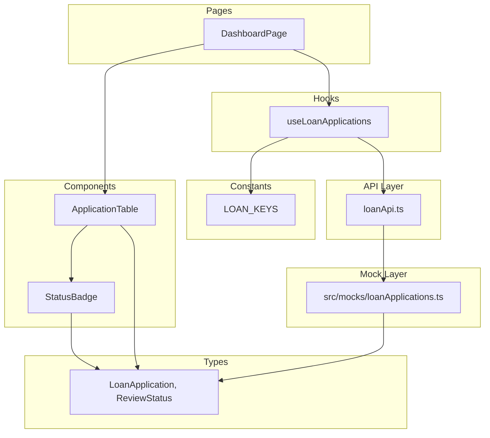
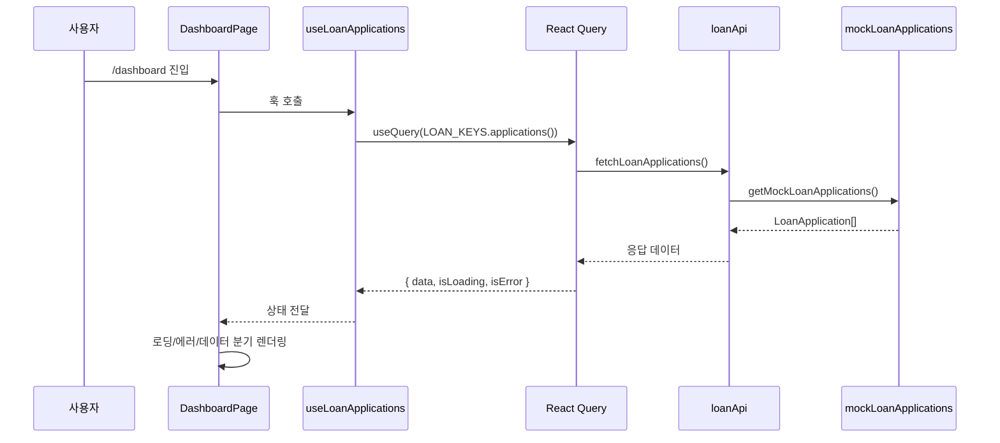

# Design Document: Loan Dashboard

## Overview

대출 현황 대시보드는 admin-front 앱의 메인 페이지(`/dashboard`)로, 은행원(ADMIN_BANK_TELLER), 지점장(ADMIN_BANK_MANAGER), 개발자(ADMIN_DEV)가 대출 신청 건을 목록으로 조회하고 심사 상태를 확인하는 화면입니다.

주요 기능:
- 대출 신청 목록을 테이블 형태로 표시 (신청일 기준 최신순)
- 심사 상태를 색상 뱃지로 시각적 구분
- 상세 페이지로의 클라이언트 사이드 라우팅
- React Query 기반 서버 상태 관리 (로딩/에러/캐싱)
- Mock 데이터 레이어를 통한 API 교체 용이성 확보

### 설계 결정 사항

| 결정 | 근거 |
|------|------|
| React Query `useQuery` 사용 | 프로젝트 컨벤션 준수, 캐싱/로딩/에러 상태 자동 관리 |
| Mock 데이터를 `src/mocks`에 분리 | 실제 API 연동 시 queryFn만 교체하면 되는 구조 |
| StatusBadge를 별도 컴포넌트로 분리 | 재사용성 확보 (심사 내역, 지점장 결재 페이지에서도 사용) |
| ApplicationTable을 별도 컴포넌트로 분리 | DashboardPage의 단일 책임 원칙 유지 |
| staleTime 30초 설정 | 동일 쿼리 키에 대한 중복 네트워크 요청 방지 |

## Architecture



### 데이터 흐름



## Components and Interfaces

### 1. DashboardPage (`src/pages/dashboard/DashboardPage.tsx`)

대시보드 페이지의 최상위 컴포넌트. 헤더, 섹션 제목, 테이블을 조합합니다.

```typescript
export default function DashboardPage(): JSX.Element
```

**책임:**
- 페이지 제목 및 설명 텍스트 렌더링
- `useLoanApplications` 훅을 통한 데이터 조회
- 로딩/에러/빈 상태 분기 처리
- "처리 대상 목록" 섹션 제목 + 총 건수 표시
- ApplicationTable에 데이터 전달

### 2. ApplicationTable (`src/components/dashboard/ApplicationTable.tsx`)

대출 신청 목록을 테이블로 렌더링하는 컴포넌트.

```typescript
interface ApplicationTableProps {
  applications: LoanApplication[];
}

export function ApplicationTable({ applications }: ApplicationTableProps): JSX.Element
```

**책임:**
- 테이블 헤더 렌더링 (신청일, 신청자명, 사업자명, 상품명, 심사 상태, 상세 정보)
- 각 행에 대출 신청 데이터 표시
- 신청일을 "YYYY.MM.DD" 형식으로 포맷
- 빈 데이터 시 안내 메시지 표시
- 각 행에 "상세보기" 버튼 렌더링 (접근성 레이블 포함)
- 상세보기 클릭 시 `/loan/{id}` 경로로 네비게이션

### 3. StatusBadge (`src/components/common/StatusBadge.tsx`)

심사 상태를 색상 뱃지로 표시하는 컴포넌트.

```typescript
interface StatusBadgeProps {
  status: ReviewStatus | string;
}

export function StatusBadge({ status }: StatusBadgeProps): JSX.Element
```

**상태별 매핑:**

| ReviewStatus | 텍스트 | 배경색 (Tailwind) |
|---|---|---|
| UNDER_REVIEW | 심사 중 | `bg-warning/10 text-warning` |
| MANAGER_REVIEW | 추가 심사 중 | `bg-info/10 text-info` |
| APPROVED | 승인 완료 | `bg-success/10 text-success` |
| REJECTED | 거절 완료 | `bg-error/10 text-error` |
| (기타) | 원본 상태값 | `bg-gray-100 text-gray-600` |

### 4. useLoanApplications Hook (`src/hooks/useLoanApplications.ts`)

대출 신청 목록을 조회하는 커스텀 훅.

```typescript
interface UseLoanApplicationsReturn {
  data: LoanApplication[] | undefined;
  isLoading: boolean;
  isError: boolean;
  error: Error | null;
  refetch: () => void;
}

export function useLoanApplications(): UseLoanApplicationsReturn
```

**설정:**
- queryKey: `LOAN_KEYS.applications()`
- queryFn: `fetchLoanApplications` (src/api/loanApi.ts)
- staleTime: 30_000 (30초)

### 5. API 함수 (`src/api/loanApi.ts`)

```typescript
export async function fetchLoanApplications(): Promise<LoanApplication[]>
```

**현재 구현:** Mock 데이터 함수를 호출하여 반환
**향후:** axiosInstance를 통한 실제 API 호출로 교체

### 6. Mock 데이터 (`src/mocks/loanApplications.ts`)

```typescript
export function getMockLoanApplications(): LoanApplication[]
```

4가지 ReviewStatus를 각각 최소 1건 이상 포함하는 샘플 데이터를 반환합니다.

## Data Models

### ReviewStatus (열거형)

```typescript
// src/types/index.ts에 추가
export type ReviewStatus = 'UNDER_REVIEW' | 'MANAGER_REVIEW' | 'APPROVED' | 'REJECTED';
```

### LoanApplication (인터페이스)

```typescript
// src/types/index.ts에 추가
export interface LoanApplication {
  /** 고유 식별자 */
  id: number;
  /** 신청일 (ISO 8601 형식: "2025-01-15") */
  applicationDate: string;
  /** 신청자명 */
  applicantName: string;
  /** 사업자명 */
  businessName: string;
  /** 대출 상품명 */
  productName: string;
  /** 심사 상태 */
  reviewStatus: ReviewStatus;
}
```

### StatusBadge 매핑 상수

```typescript
// src/components/common/StatusBadge.tsx 내부
export const STATUS_CONFIG: Record<ReviewStatus, { label: string; className: string }> = {
  UNDER_REVIEW: { label: '심사 중', className: 'bg-warning/10 text-warning' },
  MANAGER_REVIEW: { label: '추가 심사 중', className: 'bg-info/10 text-info' },
  APPROVED: { label: '승인 완료', className: 'bg-success/10 text-success' },
  REJECTED: { label: '거절 완료', className: 'bg-error/10 text-error' },
};
```

### 날짜 포맷 유틸리티

```typescript
// src/utils/formatDate.ts
export function formatDate(isoDate: string): string {
  // "2025-01-15" → "2025.01.15"
}
```

## Correctness Properties

*A property is a characteristic or behavior that should hold true across all valid executions of a system—essentially, a formal statement about what the system should do. Properties serve as the bridge between human-readable specifications and machine-verifiable correctness guarantees.*

### Property 1: 총 건수는 데이터 배열 길이와 일치한다

*For any* LoanApplication 배열이 주어졌을 때, DashboardPage가 렌더링하는 "총 N건" 텍스트의 N 값은 해당 배열의 length와 항상 동일해야 한다.

**Validates: Requirements 2.2**

### Property 2: 대출 신청 목록은 신청일 기준 내림차순으로 정렬된다

*For any* 2개 이상의 LoanApplication 배열이 주어졌을 때, ApplicationTable에 표시되는 행의 순서는 applicationDate 기준 내림차순(최신순)이어야 한다. 즉, 인접한 두 행에 대해 이전 행의 신청일이 다음 행의 신청일보다 크거나 같아야 한다.

**Validates: Requirements 3.2**

### Property 3: 날짜 포맷 변환은 YYYY.MM.DD 패턴을 준수한다

*For any* 유효한 ISO 8601 날짜 문자열("YYYY-MM-DD")에 대해, formatDate 함수의 출력은 항상 `/^\d{4}\.\d{2}\.\d{2}$/` 정규식과 일치해야 하며, 원본 날짜의 연/월/일 값이 보존되어야 한다.

**Validates: Requirements 3.4**

### Property 4: 알 수 없는 상태값은 원본 텍스트와 회색 배경으로 폴백 표시된다

*For any* 문자열이 UNDER_REVIEW, MANAGER_REVIEW, APPROVED, REJECTED 중 어느 것에도 해당하지 않을 때, StatusBadge는 해당 문자열을 그대로 텍스트로 표시하고 회색(gray) 계열 CSS 클래스를 적용해야 한다.

**Validates: Requirements 4.5**

### Property 5: 상세보기 버튼은 올바른 접근성 레이블과 네비게이션 경로를 가진다

*For any* LoanApplication에 대해, ApplicationTable의 해당 행에는 신청 건을 식별할 수 있는 aria-label을 포함한 "상세보기" 링크/버튼이 존재하며, 해당 요소의 href 또는 클릭 동작은 `/loan/{해당 application의 id}` 경로를 가리켜야 한다.

**Validates: Requirements 5.1, 5.2**

## Error Handling

### 네트워크 에러

| 상황 | 처리 방식 |
|------|-----------|
| API 호출 실패 (네트워크 오류, 5xx) | 테이블 영역에 오류 메시지 + "다시 시도" 버튼 표시 |
| 401 Unauthorized | axiosInstance 인터셉터에서 `/login`으로 리다이렉트 |
| 데이터 로딩 중 | 로딩 스피너 + "데이터를 불러오는 중입니다" 텍스트 |

### 데이터 에러

| 상황 | 처리 방식 |
|------|-----------|
| 빈 배열 반환 | "조회된 대출 신청 내역이 없습니다." 메시지 표시 |
| 알 수 없는 ReviewStatus 값 | StatusBadge에서 원본 값을 회색 배경으로 표시 (크래시 방지) |
| 날짜 형식 오류 | formatDate에서 원본 문자열 그대로 반환 (graceful degradation) |

### React Query 에러 복구

- `refetch()` 함수를 "다시 시도" 버튼에 연결하여 수동 재시도 지원
- staleTime(30초) 내 동일 요청 중복 방지
- 컴포넌트 언마운트 시 자동 쿼리 취소 (React Query 기본 동작)

## Testing Strategy

### 단위 테스트 (Vitest + React Testing Library)

| 대상 | 테스트 내용 |
|------|-------------|
| `formatDate` | ISO 날짜 → "YYYY.MM.DD" 변환 정확성 |
| `StatusBadge` | 4가지 상태별 텍스트/색상 매핑, 알 수 없는 상태 폴백 |
| `ApplicationTable` | 컬럼 헤더 순서, 빈 데이터 메시지, 행 렌더링 |
| `DashboardPage` | 로딩/에러/성공 상태별 렌더링, 총 건수 표시 |
| `useLoanApplications` | 쿼리 키, staleTime 설정 확인 |
| Mock 데이터 | 4가지 상태 포함 여부, 타입 적합성 |

### Property-Based 테스트 (fast-check)

프로젝트에 이미 `fast-check` 라이브러리가 devDependencies에 포함되어 있으므로 이를 활용합니다.

| Property | 테스트 내용 | 최소 반복 |
|----------|-------------|-----------|
| Property 1 | 배열 길이 = "총 N건"의 N | 100회 |
| Property 2 | 정렬 결과 내림차순 검증 | 100회 |
| Property 3 | formatDate 출력 패턴 + 값 보존 | 100회 |
| Property 4 | 알 수 없는 상태값 폴백 동작 | 100회 |
| Property 5 | 상세보기 링크 href = `/loan/{id}` | 100회 |

**테스트 태그 형식:** `Feature: loan-dashboard, Property {number}: {property_text}`

### 테스트 실행

```bash
# 전체 테스트
npm run test

# 특정 파일
npx vitest --run src/components/dashboard/ApplicationTable.test.tsx
```

### 테스트 파일 구조

```
src/
├── components/
│   ├── common/
│   │   └── StatusBadge.test.tsx
│   └── dashboard/
│       └── ApplicationTable.test.tsx
├── hooks/
│   └── useLoanApplications.test.ts
├── pages/
│   └── dashboard/
│       └── DashboardPage.test.tsx
├── utils/
│   └── formatDate.test.ts
└── mocks/
    └── loanApplications.test.ts
```

