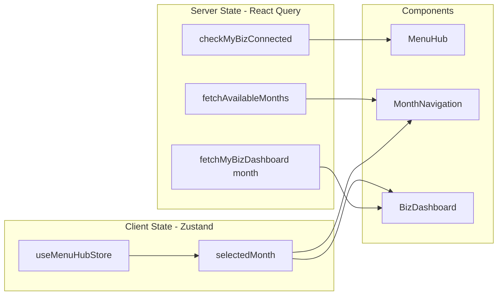

# Design Document: MyBiz Menu Hub

## Overview

마이 비즈 데이터 대시보드 진입 전에 "메뉴 선택 화면(MenuHub)"을 삽입하여, 사용자가 원하는 카테고리의 상세 데이터를 선택적으로 확인할 수 있도록 한다.

**변경 전 흐름:**
`BizDataPage(연결됨)` → 통합 대시보드(BizDashboard) 즉시 렌더링

**변경 후 흐름:**
`BizDataPage(연결됨)` → **MenuHub** → 선택한 카테고리의 BizDashboard

### 핵심 설계 결정

1. **BizDataPage 분기 로직 변경**: `isConnected === true`일 때 기존 `<BizDashboard />`를 직접 렌더링하던 것을 `<MenuHub />`로 교체한다.
2. **라우팅 전략**: MenuHub는 `/biz-data` 경로에서 렌더링되고, 상세 화면은 `/biz-data/dashboard?category={category}` 쿼리 파라미터 방식으로 동일 경로 내에서 처리한다. 이렇게 하면 기존 라우트 설정 변경을 최소화하면서 뒤로가기가 자연스럽게 MenuHub로 복귀한다.
3. **월 상태 전달**: Zustand store(`useMenuHubStore`)에 `selectedMonth`를 저장하여 MenuHub ↔ 상세 화면 간 월 정보를 공유한다.
4. **정적 콘텐츠 우선**: 메뉴 카드의 제목/설명은 프론트엔드에 하드코딩된 정적 데이터로, API 실패 시에도 네비게이션 기능이 유지된다.

## Architecture

```mermaid
graph TD
    A[BizDataPage] -->|isConnected=true| B[MenuHub]
    A -->|isConnected=false| C[IntroSection + 연결 시작 버튼]
    B --> D[MonthNavigation]
    B --> E[MenuCardList]
    B --> F[GrowthBanner]
    E --> G1[MenuCard 1: 매출]
    E --> G2[MenuCard 2: 수익/현금흐름]
    E --> G3[MenuCard 3: 고객]
    E --> G4[MenuCard 4: 업종 비교]
    E --> G5[MenuCard 5: 대출 체크]
    G1 -->|navigate| H[BizDashboard category=sales]
    G2 -->|navigate| H
    G3 -->|navigate| H
    G4 -->|navigate| H
    G5 -->|navigate| H
    F -->|navigate| I[/grade-report]
    H -->|뒤로가기| B
```

### 상태 관리 아키텍처



## Components and Interfaces

### 신규 컴포넌트

| 컴포넌트 | 경로 | 역할 |
|---|---|---|
| `MenuHub` | `src/components/bizData/MenuHub.tsx` | 메뉴 선택 화면 루트 컴포넌트 |
| `MonthNavigation` | `src/components/bizData/MonthNavigation.tsx` | 월 네비게이션 (좌우 화살표, YYYY.MM 표시) |
| `MenuCard` | `src/components/bizData/MenuCard.tsx` | 개별 메뉴 카드 (제목, 설명, chevron) |
| `GrowthBanner` | `src/components/bizData/GrowthBanner.tsx` | 성장 S등급 배너 CTA |

### 수정 대상 컴포넌트

| 컴포넌트 | 변경 내용 |
|---|---|
| `BizDataPage` | `isConnected` 시 `<MenuHub />` 렌더링으로 변경 |
| `BizDashboard` | 쿼리 파라미터 `category`에 따라 카테고리별 데이터 표시, `selectedMonth`를 store에서 읽기 |

### 컴포넌트 인터페이스

```typescript
// MenuHub.tsx
// Props 없음 — 내부적으로 store와 React Query 사용
export function MenuHub(): JSX.Element;

// MonthNavigation.tsx
interface MonthNavigationProps {
  availableMonths: string[];       // 서버에서 받은 가용 월 목록 (내림차순)
  selectedMonth: string;           // 현재 선택된 월 "YYYY-MM"
  onMonthChange: (month: string) => void; // 월 변경 콜백
}

// MenuCard.tsx
interface MenuCardProps {
  title: string;                   // 카드 제목
  description?: string;            // 카드 설명 (선택)
  onPress: () => void;             // 탭 핸들러
}

// GrowthBanner.tsx
// Props 없음 — 내부에서 useNavigate 사용
export function GrowthBanner(): JSX.Element;
```

### 신규 Hook

| Hook | 경로 | 역할 |
|---|---|---|
| `useAvailableMonths` | `src/hooks/useAvailableMonths.ts` | React Query로 availableMonths 조회 |

```typescript
// useAvailableMonths.ts
interface UseAvailableMonthsReturn {
  availableMonths: string[];
  isLoading: boolean;
  isError: boolean;
}
export function useAvailableMonths(): UseAvailableMonthsReturn;
```

### 신규 Store

| Store | 경로 | 역할 |
|---|---|---|
| `useMenuHubStore` | `src/stores/menuHubStore.ts` | 선택된 조회 월 상태 관리 |

```typescript
// menuHubStore.ts
interface MenuHubState {
  selectedMonth: string;
  setSelectedMonth: (month: string) => void;
  reset: () => void;
}
```

### API 함수 (mybizApi.ts 확장)

```typescript
/** 사용 가능 월 목록 조회 — 기존 fetchMyBizDashboard에서 availableMonths 추출 */
export async function fetchAvailableMonths(): Promise<string[]>;
```

기존 `fetchMyBizDashboard`가 이미 `availableMonths`를 반환하므로, 별도 엔드포인트 없이 해당 응답에서 추출한다. `useAvailableMonths` 훅은 `fetchMyBizDashboard()`를 호출하여 `availableMonths` 필드만 select하는 방식으로 구현한다.

## Data Models

### 메뉴 카드 정적 데이터 모델

```typescript
// types/menuHub.ts

/** 메뉴 카테고리 식별자 */
export type MenuCategory = "sales" | "profit" | "customer" | "industry" | "loan-check";

/** 메뉴 카드 아이템 정의 */
export interface MenuItem {
  id: MenuCategory;
  title: string;
  description: string;
}

/** 메뉴 카드 목록 (하드코딩 상수) */
export const MENU_ITEMS: MenuItem[] = [
  {
    id: "sales",
    title: "이번 달 장사는 어땠나요?",
    description: "매출 흐름과 주요 변화를 한눈에 요약",
  },
  {
    id: "profit",
    title: "실제로 얼마나 남았나요?",
    description: "수익과 현금 흐름을 정리해 핵심만 표시",
  },
  {
    id: "customer",
    title: "손님들은 다시 찾아오고 있나요?",
    description: "재방문과 고객 반응이 어떤지 요약",
  },
  {
    id: "industry",
    title: "우리 가게는 다른 가게보다 잘하고 있나요?",
    description: "업종 안에서 우리 가게 위치를 쉽게 표시",
  },
  {
    id: "loan-check",
    title: "지금 챙기면 좋을 것들",
    description: "대출 심사 전에 살펴보면 좋은 항목을 정리",
  },
];
```

### Store 상태 모델

```typescript
// stores/menuHubStore.ts
interface MenuHubState {
  /** 현재 선택된 조회 월 (형식: "YYYY-MM") */
  selectedMonth: string;
  setSelectedMonth: (month: string) => void;
  reset: () => void;
}
```

### 기존 타입 활용

- `BizDashboardData` (types/bizData.ts): 상세 화면 데이터 — 변경 없음
- `MyBizDashboardResult` (types/mybizApi.ts): API 원시 응답 — 변경 없음
- `availableMonths: string[]`: 이미 `MyBizDashboardResult`에 포함됨

### 라우팅 파라미터

```typescript
// 상세 화면 진입 시 URL: /biz-data/dashboard?category=sales
// useSearchParams로 category를 추출
type DashboardSearchParams = {
  category: MenuCategory;
};
```


## Correctness Properties

*A property is a characteristic or behavior that should hold true across all valid executions of a system — essentially, a formal statement about what the system should do. Properties serve as the bridge between human-readable specifications and machine-verifiable correctness guarantees.*

### Property 1: MonthNavigation 초기값은 항상 가장 최신 월

*For any* non-empty `availableMonths` 배열(내림차순 정렬)에 대해, MonthNavigation의 초기 `selectedMonth`는 항상 배열의 첫 번째 요소(가장 최신 월)와 동일해야 한다.

**Validates: Requirements 2.2**

### Property 2: MonthNavigation 이동은 배열 범위 내에서만 동작

*For any* non-empty `availableMonths` 배열과 해당 배열 내 임의의 현재 인덱스에 대해:
- 왼쪽 이동(이전 월) 시: 현재 인덱스가 마지막이 아니면 `index + 1` 위치의 월로 변경되고, 마지막이면 변경되지 않는다.
- 오른쪽 이동(다음 월) 시: 현재 인덱스가 첫 번째가 아니면 `index - 1` 위치의 월로 변경되고, 첫 번째이면 변경되지 않는다.
- 어떤 이동 연산이든, 결과 `selectedMonth`는 항상 `availableMonths` 배열에 포함된 값이어야 한다.

**Validates: Requirements 2.3, 2.4, 2.5, 2.6**

### Property 3: 메뉴 카드 탭 시 올바른 카테고리로 네비게이션

*For any* `MENU_ITEMS` 배열의 원소(MenuItem)에 대해, 해당 카드를 탭하면 네비게이션 대상 URL에 해당 MenuItem의 `id`가 `category` 파라미터로 포함되어야 한다.

**Validates: Requirements 3.7**

### Property 4: MenuCard 접근성 속성 및 조건부 렌더링

*For any* 유효한 `title` 문자열과 선택적 `description`에 대해:
- 렌더링된 MenuCard는 `role="button"`을 가지며, `aria-label`은 전달된 `title`과 동일해야 한다.
- `description`이 제공되지 않으면(undefined), 설명 텍스트 요소가 렌더링되지 않고 제목만 표시되어야 한다.
- `description`이 제공되면, 해당 텍스트가 렌더링되어야 한다.

**Validates: Requirements 4.3, 4.6**

### Property 5: selectedMonth 상태 전달 및 복귀 시 유지

*For any* 유효한 월 문자열(YYYY-MM 형식)에 대해:
- MenuHub에서 해당 월을 선택한 상태에서 카드를 탭하면, store의 `selectedMonth`가 해당 값을 유지해야 한다.
- 상세 화면에서 뒤로 돌아온 후에도 store의 `selectedMonth`는 변경되지 않아야 한다.

**Validates: Requirements 7.1, 7.4**

## Error Handling

### API 에러 처리 전략

| 에러 상황 | 컴포넌트 | 처리 방식 |
|---|---|---|
| My Biz Data 연결 상태 조회 실패 | BizDataPage | `isConnected = false`로 처리 → IntroSection 표시 |
| availableMonths 조회 실패 | MonthNavigation | 현재 시스템 날짜 기준 월을 단독 표시, 좌우 화살표 모두 disabled |
| 상세 화면 카테고리 데이터 로딩 실패 | BizDashboard | 에러 메시지 + 재시도 버튼 표시 |
| 상세 화면 해당 월 데이터 미존재 (404) | BizDashboard | "데이터가 없습니다" 안내 메시지 표시 |

### 에러 바운더리

- MenuHub 자체는 정적 콘텐츠(MENU_ITEMS)를 기반으로 하므로, API 에러 시에도 카드 리스트와 네비게이션은 정상 동작한다.
- `useAvailableMonths` 훅에서 에러 발생 시 `availableMonths`는 빈 배열로 처리하되, 현재 시스템 월을 fallback으로 사용한다.

### 로딩 상태

| 컴포넌트 | 로딩 시 표현 |
|---|---|
| BizDataPage (연결 상태 조회) | `CharacterLoadingSpinner` 표시 |
| BizDashboard (카테고리 데이터 로딩) | 로딩 인디케이터 표시 |
| MonthNavigation (월 목록 조회) | 기본 월(시스템 현재 월) 표시 후 데이터 도착 시 업데이트 |

## Testing Strategy

### 단위 테스트 (Vitest + React Testing Library)

**Example-based 테스트:**
- BizDataPage 조건부 렌더링 (isConnected true/false/loading/error)
- MenuHub 5개 카드 렌더링 확인
- 각 카드의 제목/설명 텍스트 정확성
- GrowthBanner 렌더링 및 네비게이션
- 상세 화면 뒤로가기 동작
- 상세 화면 로딩/에러/빈 데이터 상태 표시

**Edge-case 테스트:**
- API 실패 시 fallback 동작
- availableMonths 빈 배열 처리
- 해당 월 데이터 미존재 시 안내 메시지

### Property-based 테스트 (Vitest + fast-check)

**라이브러리:** `fast-check` (TypeScript/JavaScript에서 가장 성숙한 PBT 라이브러리)

**설정:**
- 각 property test는 최소 100회 반복 실행
- 각 테스트에 설계 문서의 property 번호를 태그로 포함

**태그 형식:** `Feature: mybiz-menu-hub, Property {N}: {title}`

| Property | 테스트 대상 | 생성기(Arbitrary) |
|---|---|---|
| 1 | MonthNavigation 초기값 | `fc.array(fc.string().filter(s => /^\d{4}-\d{2}$/.test(s)), {minLength: 1})` |
| 2 | MonthNavigation 이동 및 경계 | 위 배열 + `fc.nat()` (인덱스) + `fc.oneof(fc.constant('left'), fc.constant('right'))` |
| 3 | 카드→category 매핑 | `fc.constantFrom(...MENU_ITEMS)` |
| 4 | MenuCard 접근성/조건부 렌더링 | `fc.string({minLength: 1})` (title) + `fc.option(fc.string({minLength: 1}))` (description) |
| 5 | selectedMonth 유지 | `fc.string().filter(s => /^\d{4}-\d{2}$/.test(s))` |

### 통합 테스트

- BizDataPage → MenuHub → 카드 탭 → BizDashboard → 뒤로가기 전체 플로우
- BizDataCollectPage 완료 후 → MenuHub 진입 네비게이션

### 빌드 검증 (Smoke)

- `npm run build` exit code 0
- TypeScript strict 모드 컴파일 성공
- 파일명/디렉토리 컨벤션 준수
