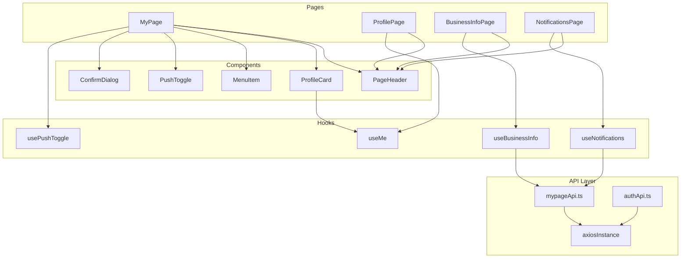

# Design Document: 마이페이지 UI

## Overview

SoFit 고객용 앱(user-front)의 마이페이지 UI를 구현한다. 기존 placeholder 파일들을 스크린샷 디자인에 맞춰 완성하며, 프로필 확인, 사업자 정보 조회, 푸시 알림 설정, 로그아웃, 회원 탈퇴 기능을 제공한다.

### 설계 결정사항

1. **연락처(phone) 정보 처리**: 기존 `LoginUser` 타입에 phone 필드가 없으므로, `/api/users/me` 응답에 `phone` 필드를 추가하는 방식으로 처리한다. `MeResponse.result` 타입을 확장하여 `UserProfile` 타입을 정의하고, 기존 `useMe()` 훅은 변경하지 않되 ProfilePage에서 별도 프로필 상세 API(`GET /api/users/me/profile`)를 호출한다.
2. **푸시 알림 상태**: 서버 연동 없이 localStorage로 관리 (MVP 단계)
3. **확인 다이얼로그**: 재사용 가능한 `ConfirmDialog` 컴포넌트로 구현
4. **PageHeader**: 뒤로가기 + 타이틀 패턴을 재사용 가능한 컴포넌트로 추출

## Architecture



## Components and Interfaces

### 1. PageHeader

뒤로가기 버튼과 타이틀을 표시하는 재사용 가능한 헤더 컴포넌트.

```typescript
interface PageHeaderProps {
  title: string;
  onBack?: () => void; // 미지정 시 navigate(-1)
}
```

- `ArrowLeft` 아이콘 (lucide-react) + 타이틀 텍스트
- sticky top-0, 흰색 배경, 하단 border

### 2. ProfileCard

마이페이지 상단 프로필 영역.

```typescript
interface ProfileCardProps {
  name: string;
  loginId: string;
}
```

- 좌측: SoFit 캐릭터 아바타 (64px 원형)
- 우측: 이름 (bold) + 아이디 (secondary color)
- 흰색 배경 카드, 둥근 모서리 (radius-xl)

### 3. MenuItem

메뉴 목록의 개별 항목.

```typescript
interface MenuItemProps {
  label: string;
  to?: string;           // Link 래핑 (네비게이션)
  onClick?: () => void;  // 클릭 핸들러 (로그아웃/탈퇴)
  variant?: 'default' | 'danger'; // danger: 빨간색 텍스트
}
```

- 좌측: 텍스트 라벨
- 우측: `ChevronRight` 아이콘 (lucide-react)
- `to` 지정 시 `<Link>` 래핑, `onClick` 지정 시 `<button>` 래핑
- variant='danger' 시 텍스트 color-error 적용

### 4. PushToggle

푸시 알림 설정 토글 컴포넌트.

```typescript
interface PushToggleProps {
  enabled: boolean;
  onToggle: (value: boolean) => void;
}
```

- 좌측: "푸시 알림" 제목 + "대출 심사 상태 변경 알림을 받습니다" 설명
- 우측: 토글 스위치 (ON: primary color, OFF: gray)
- 별도 카드 영역으로 분리

### 5. ConfirmDialog

확인/취소 모달 다이얼로그.

```typescript
interface ConfirmDialogProps {
  open: boolean;
  title: string;
  description?: string;
  confirmLabel?: string;  // 기본값: "확인"
  cancelLabel?: string;   // 기본값: "취소"
  variant?: 'default' | 'danger'; // danger: 확인 버튼 빨간색
  onConfirm: () => void;
  onCancel: () => void;
}
```

- 배경 오버레이 (반투명 검정)
- 중앙 정렬 모달 카드
- 타이틀 + 설명 + 버튼 영역
- z-index: --z-modal (100)

### 6. usePushToggle 훅

```typescript
interface UsePushToggleReturn {
  enabled: boolean;
  toggle: () => void;
}
```

- localStorage key: `sofit_push_enabled`
- 초기값: localStorage에 저장된 값 또는 true (기본 활성화)
- toggle() 호출 시 상태 반전 + localStorage 저장

### 7. useBusinessInfo 훅

```typescript
interface BusinessInfo {
  businessNumber: string;   // 사업자등록번호
  companyName: string;      // 상호명
  industry: string;         // 업종
  openDate: string;         // 개업일
  representativeName: string; // 대표자명
}

function useBusinessInfo(): {
  data: BusinessInfo | undefined;
  isLoading: boolean;
  isError: boolean;
}
```

- React Query `useQuery` 사용
- queryKey: `MYPAGE_KEYS.business`
- queryFn: `GET /api/users/me/business`

### 8. useNotifications 훅

```typescript
interface Notification {
  id: number;
  title: string;
  content: string;
  createdAt: string;       // ISO 8601
  isRead: boolean;
}

function useNotifications(): {
  data: Notification[] | undefined;
  isLoading: boolean;
  isError: boolean;
}
```

- React Query `useQuery` 사용
- queryKey: `MYPAGE_KEYS.notifications`
- queryFn: `GET /api/notifications`

## Data Models

### 타입 정의 (`src/types/mypage.ts`)

```typescript
/** 사용자 프로필 상세 (ProfilePage용) */
export interface UserProfile {
  userId: number;
  loginId: string;
  name: string;
  phone: string;
  role: string;
}

/** 사업자 정보 */
export interface BusinessInfo {
  businessNumber: string;
  companyName: string;
  industry: string;
  openDate: string;
  representativeName: string;
}

/** 알림 항목 */
export interface NotificationItem {
  id: number;
  title: string;
  content: string;
  createdAt: string;
  isRead: boolean;
}

/** 사업자 정보 API 응답 */
export interface BusinessInfoResponse {
  isSuccess: boolean;
  code: string;
  message: string;
  result: BusinessInfo;
}

/** 알림 목록 API 응답 */
export interface NotificationsResponse {
  isSuccess: boolean;
  code: string;
  message: string;
  result: NotificationItem[];
}

/** 사용자 프로필 API 응답 */
export interface UserProfileResponse {
  isSuccess: boolean;
  code: string;
  message: string;
  result: UserProfile;
}
```

### API 함수 (`src/api/mypageApi.ts`)

```typescript
import axiosInstance from "./axiosInstance";
import type {
  BusinessInfoResponse,
  NotificationsResponse,
  UserProfileResponse,
} from "@/types/mypage";

/** 사용자 프로필 상세 조회 */
export async function fetchUserProfile(): Promise<UserProfileResponse> {
  const res = await axiosInstance.get<UserProfileResponse>("/users/me/profile");
  return res.data;
}

/** 사업자 정보 조회 */
export async function fetchBusinessInfo(): Promise<BusinessInfoResponse> {
  const res = await axiosInstance.get<BusinessInfoResponse>("/users/me/business");
  return res.data;
}

/** 알림 목록 조회 */
export async function fetchNotifications(): Promise<NotificationsResponse> {
  const res = await axiosInstance.get<NotificationsResponse>("/notifications");
  return res.data;
}

/** 로그아웃 */
export async function postLogout(): Promise<void> {
  await axiosInstance.post("/auth/logout");
}

/** 회원 탈퇴 */
export async function deleteAccount(): Promise<void> {
  await axiosInstance.delete("/users/me");
}
```

### Query Keys 확장 (`src/constants/queryKeys.ts`)

```typescript
export const MYPAGE_KEYS = {
  all: ["mypage"] as const,
  profile: () => [...MYPAGE_KEYS.all, "profile"] as const,
  business: () => [...MYPAGE_KEYS.all, "business"] as const,
  notifications: () => [...MYPAGE_KEYS.all, "notifications"] as const,
} as const;
```


## Correctness Properties

*A property is a characteristic or behavior that should hold true across all valid executions of a system—essentially, a formal statement about what the system should do. Properties serve as the bridge between human-readable specifications and machine-verifiable correctness guarantees.*

### Property 1: 푸시 알림 설정 round-trip

*For any* boolean 값 v, localStorage에 `sofit_push_enabled`를 v로 설정한 후 `usePushToggle` 훅을 마운트하면, 반환되는 `enabled` 값은 v와 동일해야 한다. 또한 `toggle()`을 호출하면 localStorage에 저장된 값은 `!v`가 되어야 한다.

**Validates: Requirements 3.2, 3.3**

### Property 2: 알림 목록 렌더링 완전성

*For any* 유효한 `NotificationItem[]` 배열이 주어졌을 때, NotificationsPage가 해당 데이터를 렌더링하면 배열의 모든 항목에 대해 제목(title), 내용(content), 시간(createdAt) 텍스트가 DOM에 존재해야 한다.

**Validates: Requirements 8.3**

## Error Handling

### API 에러 처리 전략

| 상황 | 처리 방식 |
|------|-----------|
| 사업자 정보 API 실패 | BusinessInfoPage에 에러 메시지 표시 ("정보를 불러올 수 없습니다") |
| 알림 목록 API 실패 | NotificationsPage에 에러 메시지 표시 ("알림을 불러올 수 없습니다") |
| 로그아웃 API 실패 | toast 또는 alert로 에러 안내, 다이얼로그 유지 |
| 회원 탈퇴 API 실패 | toast 또는 alert로 에러 안내, 다이얼로그 유지 |
| 401 Unauthorized | axiosInstance 인터셉터에서 /login으로 리다이렉트 (기존 로직) |

### 로딩 상태 처리

- ProfilePage, BusinessInfoPage, NotificationsPage: 데이터 로딩 중 스켈레톤 또는 스피너 표시
- MyPage: useMe 데이터는 이미 캐시되어 있으므로 별도 로딩 처리 불필요

### 빈 상태 처리

- 알림 목록이 비어있을 때: "알림이 없습니다" 메시지 + 빈 상태 일러스트

## Testing Strategy

### 단위 테스트 (Vitest + React Testing Library)

이 기능은 주로 UI 렌더링과 네비게이션 위주이므로, **example-based 단위 테스트**가 주요 테스트 전략이다.

**테스트 대상:**
1. **MyPage 렌더링**: 프로필 카드, 메뉴 항목, 푸시 알림 토글이 올바르게 표시되는지
2. **네비게이션**: 메뉴 항목 클릭 시 올바른 경로로 이동하는지
3. **ConfirmDialog 동작**: 로그아웃/탈퇴 확인 다이얼로그 열기/닫기/확인
4. **ProfilePage 렌더링**: 사용자 정보 표시
5. **BusinessInfoPage 렌더링**: 사업자 정보 표시, 로딩/에러 상태
6. **NotificationsPage 렌더링**: 알림 목록 표시, 빈 상태, 에러 상태
7. **usePushToggle 훅**: localStorage 연동 동작

### Property-Based 테스트 (Vitest + fast-check)

PBT 라이브러리: **fast-check** (TypeScript 생태계에서 가장 널리 사용)

**적용 대상:**
- Property 1: `usePushToggle` 훅의 localStorage round-trip
- Property 2: NotificationsPage의 알림 목록 렌더링 완전성

**설정:**
- 최소 100회 반복 실행
- 각 테스트에 property 번호와 요구사항 참조 주석 포함
- Tag format: `Feature: mypage-ui, Property N: {property_text}`

### 테스트 범위 요약

| 카테고리 | 테스트 방식 | 대상 |
|----------|-------------|------|
| UI 렌더링 | Example-based | 모든 페이지 컴포넌트 |
| 네비게이션 | Example-based | MenuItem, PageHeader |
| 다이얼로그 동작 | Example-based | ConfirmDialog |
| API 호출 | Example-based (mock) | 로그아웃, 탈퇴, 사업자 정보, 알림 |
| localStorage 연동 | Property-based | usePushToggle |
| 데이터 렌더링 완전성 | Property-based | NotificationsPage |
| 에러/빈 상태 | Edge-case | BusinessInfoPage, NotificationsPage |
