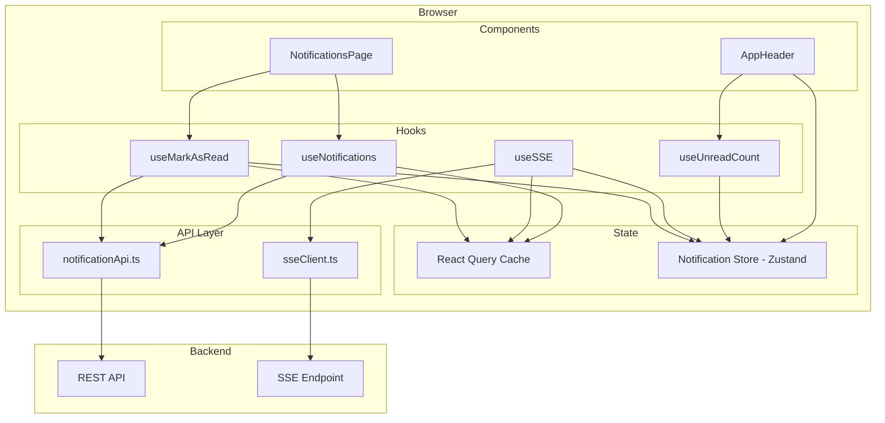
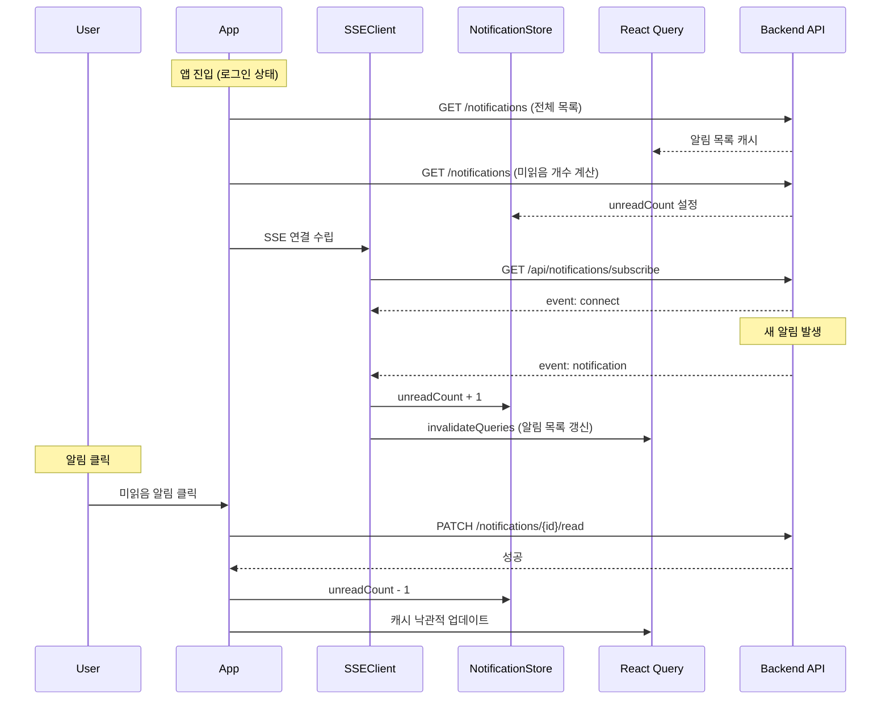

# Design Document: Notification API Integration

## Overview

이 설계 문서는 SoFit 고객용 앱(user-front)의 알림 시스템을 Mock 데이터 기반에서 실제 백엔드 API 연동으로 전환하는 기능을 다룬다. 핵심 구성 요소는 다음과 같다:

1. **SSE(Server-Sent Events) 클라이언트**: 실시간 알림 수신을 위한 EventSource 기반 연결 관리
2. **알림 API 레이어**: REST API를 통한 알림 목록 조회 및 읽음 처리
3. **알림 상태 저장소**: Zustand 기반 클라이언트 상태 (미읽음 개수, SSE 연결 상태)
4. **UI 컴포넌트 리팩토링**: Mock 의존성 제거 및 실제 데이터 바인딩

### 설계 원칙

- React Query는 서버 상태(알림 목록), Zustand는 클라이언트 상태(미읽음 개수, SSE 연결 상태)를 관리
- SSE는 브라우저 네이티브 `EventSource` API를 사용 (별도 라이브러리 불필요)
- 모든 API 호출은 `axiosInstance`를 경유하며, SSE 연결은 `EventSource`로 직접 처리
- 기존 컴포넌트 구조와 스타일링 패턴을 유지하면서 데이터 소스만 교체

## Architecture

### 고수준 아키텍처



### 데이터 흐름



## Components and Interfaces

### 1. SSE 클라이언트 모듈 (`src/api/sseClient.ts`)

SSE 연결 수립, 이벤트 처리, 자동 재연결 로직을 캡슐화한다.

```typescript
interface SSEClientOptions {
  url: string;
  onConnect: () => void;
  onNotification: (data: NotificationItem) => void;
  onError: (error: Event) => void;
  maxRetries?: number;       // 기본값: 5
  retryInterval?: number;    // 기본값: 3000ms
}

interface SSEClientReturn {
  connect: () => void;
  disconnect: () => void;
  isConnected: boolean;
}
```

**책임:**
- `EventSource` 인스턴스 생성 및 관리
- `event: connect` 수신 시 연결 확인 콜백 호출
- `event: notification` 수신 시 알림 데이터 파싱 후 콜백 호출
- 연결 끊김 시 지수 백오프 없이 3초 간격 재연결 (최대 5회)
- 재연결 횟수 초과 시 에러 콜백 호출 및 재연결 중단
- `disconnect()` 호출 시 EventSource 종료 및 재연결 타이머 정리

### 2. 알림 API 모듈 (`src/api/notificationApi.ts`)

기존 `mypageApi.ts`의 `fetchNotifications`를 확장하고, 읽음 처리 API를 추가한다.

```typescript
// 알림 목록 조회 (기존 함수 유지)
function fetchNotifications(): Promise<NotificationsResponse>;

// 알림 읽음 처리
function markNotificationAsRead(notificationId: number): Promise<ApiResponse<void>>;
```

### 3. 알림 상태 저장소 (`src/stores/notificationStore.ts`)

```typescript
interface NotificationState {
  /** 미읽음 알림 개수 */
  unreadCount: number;
  /** SSE 연결 상태 */
  connectionStatus: 'connected' | 'disconnected' | 'reconnecting' | 'failed';
  /** 미읽음 개수 설정 */
  setUnreadCount: (count: number) => void;
  /** 미읽음 개수 증가 */
  incrementUnread: () => void;
  /** 미읽음 개수 감소 (최솟값 0) */
  decrementUnread: () => void;
  /** SSE 연결 상태 설정 */
  setConnectionStatus: (status: NotificationState['connectionStatus']) => void;
  /** 상태 초기화 (로그아웃 시) */
  reset: () => void;
}
```

### 4. 커스텀 훅

#### `useSSE` (`src/hooks/useSSE.ts`)

앱 레벨에서 SSE 연결을 관리하는 훅. 로그인 상태에서만 연결을 수립한다.

```typescript
function useSSE(): void;
// 내부 동작:
// - useMe()로 로그인 상태 확인
// - 로그인 시 SSE 연결 수립, 로그아웃 시 연결 종료
// - notification 이벤트 수신 시 notificationStore.incrementUnread() + queryClient.invalidateQueries
```

#### `useNotifications` (기존 훅 확장)

```typescript
function useNotifications(): {
  data: NotificationItem[] | undefined;
  isLoading: boolean;
  isError: boolean;
  refetch: () => void;
};
```

#### `useMarkAsRead` (`src/hooks/useMarkAsRead.ts`)

```typescript
function useMarkAsRead(): {
  markAsRead: (notificationId: number) => void;
  isPending: boolean;
};
// 내부 동작:
// - useMutation으로 PATCH /notifications/{id}/read 호출
// - 성공 시: 알림 목록 캐시 낙관적 업데이트 + notificationStore.decrementUnread()
// - 실패 시: 캐시 롤백 + 에러 토스트 3초 표시
// - 타임아웃: 5초
```

#### `useUnreadCount` (`src/hooks/useUnreadCount.ts`)

```typescript
function useUnreadCount(): {
  unreadCount: number;
  isLoading: boolean;
};
// 내부 동작:
// - 앱 진입 시 fetchNotifications()로 미읽음 개수 계산
// - notificationStore의 unreadCount를 반환
```

### 5. UI 컴포넌트 변경

#### `AppHeader` 변경사항
- `MOCK_NOTIFICATIONS` import 제거
- `useNotificationStore`에서 `unreadCount` 참조
- 뱃지 표시 로직: `unreadCount > 0` 시 표시, `> 99` 시 "99+"

#### `NotificationsPage` 변경사항
- `MOCK_NOTIFICATIONS` import 제거
- `useNotifications()` 훅으로 데이터 조회
- 로딩 상태: 스피너 표시
- 에러 상태: 에러 메시지 + 재시도 버튼
- 빈 상태: "알림이 없습니다" 메시지
- 각 알림 항목 클릭 시 `useMarkAsRead` 호출

#### `notificationIcon.tsx` 변경사항
- `NotificationType` 타입을 `@/types/mypage`에서 import
- 타입 매핑 변경: `LOAN_APPLIED` → `LOAN_SUBMITTED`, `LOAN_REVIEWED` → `LOAN_DECIDED`
- 기본 fallback 아이콘 추가 (알 수 없는 타입 대응)

### 6. Vite 프록시 설정 변경

SSE 엔드포인트를 위한 프록시 설정 추가:

```typescript
// vite.config.ts server.proxy에 추가
"/api/notifications/subscribe": {
  target: env.VITE_DEV_API_PROXY_TARGET,
  changeOrigin: true,
  // SSE를 위해 버퍼링 비활성화 필수
  configure: (proxy) => {
    proxy.on('proxyRes', (proxyRes) => {
      proxyRes.headers['cache-control'] = 'no-cache';
      proxyRes.headers['x-accel-buffering'] = 'no';
    });
  },
}
```

## Data Models

### 타입 정의 변경 (`src/types/mypage.ts`)

```typescript
/** 알림 타입 */
export type NotificationType = "LOAN_SUBMITTED" | "LOAN_DECIDED" | "LOAN_EXECUTED";

/** 알림 항목 (확장) */
export interface NotificationItem {
  id: number;
  type: NotificationType;
  title: string;
  content: string;
  createdAt: string;
  isRead: boolean;
  applicationId: number;
}
```

### API 응답 형식

```typescript
/** 공통 API 응답 래퍼 */
interface ApiResponse<T> {
  isSuccess: boolean;
  code: string;
  message: string;
  result: T;
}

/** 알림 목록 응답 */
type NotificationsResponse = ApiResponse<NotificationItem[]>;

/** 읽음 처리 응답 */
type MarkAsReadResponse = ApiResponse<null>;
```

### SSE 이벤트 데이터 형식

```typescript
/** SSE connect 이벤트 */
// event: connect
// data: connected

/** SSE notification 이벤트 */
// event: notification
// data: JSON string of NotificationItem
interface SSENotificationEvent {
  id: number;
  type: NotificationType;
  title: string;
  content: string;
  createdAt: string;
  isRead: false;
  applicationId: number;
}
```

### 알림 타입별 아이콘/색상 매핑

| 타입 | 아이콘 (lucide-react) | 아이콘 색상 | 배경색 |
|------|----------------------|------------|--------|
| LOAN_SUBMITTED | `FileText` | `text-primary` | `bg-primary/10` |
| LOAN_DECIDED | `FileCheck` | `text-primary` | `bg-primary/10` |
| LOAN_EXECUTED | `Megaphone` | `text-green-600` | `bg-green-100` |
| (기본 fallback) | `Bell` | `text-gray-500` | `bg-gray-100` |


## Correctness Properties

*A property is a characteristic or behavior that should hold true across all valid executions of a system—essentially, a formal statement about what the system should do. Properties serve as the bridge between human-readable specifications and machine-verifiable correctness guarantees.*

### Property 1: 미읽음 개수 계산 정확성

*For any* `NotificationItem[]` 배열에 대해, 미읽음 개수 계산 함수는 배열 내 `isRead === false`인 항목의 정확한 개수를 반환해야 한다.

**Validates: Requirements 2.2**

### Property 2: 뱃지 포맷팅 규칙

*For any* 양의 정수 `n`에 대해, 뱃지 포맷 함수는 `n`이 1~99 범위이면 `n`을 문자열로 반환하고, `n`이 100 이상이면 `"99+"`를 반환하며, `n`이 0이면 `null`을 반환해야 한다.

**Validates: Requirements 2.3, 2.4, 2.5**

### Property 3: 알림 항목 렌더링 완전성

*For any* 유효한 `NotificationItem`에 대해, 렌더링된 알림 항목은 반드시 제목(title)과 내용(content)을 포함해야 하며, `isRead === false`인 경우에만 미읽음 표시(파란 점)가 존재해야 한다.

**Validates: Requirements 3.2, 3.3**

### Property 4: 알림 타입별 아이콘 고유성

*For any* 서로 다른 두 `NotificationType` 값에 대해, `getNotificationIcon` 함수가 반환하는 아이콘 또는 배경색 중 적어도 하나는 달라야 한다.

**Validates: Requirements 3.4, 5.5**

### Property 5: 미읽음 개수 감소 하한 보장

*For any* 음이 아닌 정수 `unreadCount`에 대해, `decrementUnread` 호출 후의 값은 `max(0, unreadCount - 1)`과 같아야 한다.

**Validates: Requirements 4.3**

### Property 6: 알 수 없는 알림 타입 안전 처리

*For any* 정의된 3가지 타입(`LOAN_SUBMITTED`, `LOAN_DECIDED`, `LOAN_EXECUTED`)에 해당하지 않는 문자열에 대해, `getNotificationIcon` 함수는 에러를 발생시키지 않고 기본 아이콘과 기본 배경색을 반환해야 한다.

**Validates: Requirements 5.4**

## Error Handling

### SSE 연결 에러

| 상황 | 처리 방식 |
|------|-----------|
| SSE 연결 실패 | 3초 간격으로 최대 5회 자동 재연결 시도 |
| 재연결 5회 초과 | `connectionStatus`를 `'failed'`로 설정, 재연결 중단 |
| SSE 이벤트 파싱 실패 | 해당 이벤트 무시, 연결 유지 |

### API 호출 에러

| 상황 | 처리 방식 |
|------|-----------|
| 알림 목록 조회 실패 | 에러 메시지 + 재시도 버튼 표시 |
| 미읽음 개수 조회 실패 | 뱃지 숨김, unreadCount를 0으로 리셋 |
| 읽음 처리 실패 | 낙관적 업데이트 롤백, 에러 토스트 3초 표시 |
| 읽음 처리 타임아웃 (5초) | 요청 취소, 미읽음 상태 유지 |

### 네트워크 에러

| 상황 | 처리 방식 |
|------|-----------|
| 401 Unauthorized | axiosInstance 인터셉터에서 `/login`으로 리다이렉트 |
| 네트워크 오프라인 | SSE 자동 재연결 로직에 의해 처리 |

### 에러 UI 패턴

```typescript
// 에러 토스트 (읽음 처리 실패 시)
interface ErrorToast {
  message: string;
  duration: 3000; // 3초
  type: 'error';
}

// 에러 상태 (알림 목록 조회 실패 시)
interface ErrorState {
  message: string;      // "알림을 불러오지 못했습니다"
  retryAction: () => void;  // refetch 함수
}
```

## Testing Strategy

### 테스트 프레임워크

- **단위 테스트**: Vitest + React Testing Library (기존 프로젝트 설정 활용)
- **Property-Based Testing**: `fast-check` 라이브러리 (Vitest와 호환)

### Property-Based Tests

각 Correctness Property에 대해 `fast-check`를 사용한 property test를 작성한다.

**설정:**
- 최소 100회 반복 실행
- 각 테스트에 설계 문서 property 참조 태그 포함

```typescript
// 태그 형식 예시
// Feature: notification-api-integration, Property 1: 미읽음 개수 계산 정확성
```

**대상 함수:**
1. `computeUnreadCount(notifications: NotificationItem[]): number`
2. `formatBadgeCount(count: number): string | null`
3. `getNotificationIcon(type: string): NotificationIconConfig`
4. `decrementUnread` (Zustand store action)

### Unit Tests (Example-Based)

| 대상 | 테스트 내용 |
|------|------------|
| `sseClient` | 연결 수립, connect 이벤트 처리, notification 이벤트 처리, 재연결 로직, disconnect |
| `useNotifications` | 로딩/성공/에러 상태 반환 |
| `useMarkAsRead` | 성공 시 캐시 업데이트, 실패 시 롤백, 타임아웃 처리 |
| `NotificationsPage` | 로딩 UI, 에러 UI, 빈 상태, 알림 목록 렌더링 |
| `AppHeader` | 뱃지 표시/숨김, "99+" 표시 |

### Integration Tests

| 대상 | 테스트 내용 |
|------|------------|
| `useSSE` + `notificationStore` | SSE 이벤트 수신 → store 업데이트 → UI 반영 흐름 |
| 알림 클릭 → 읽음 처리 | 클릭 → API 호출 → 캐시 업데이트 → UI 반영 전체 흐름 |

### 테스트 유틸리티

```typescript
// SSE Mock (테스트용)
class MockEventSource {
  // EventSource API를 모킹하여 테스트에서 SSE 이벤트를 시뮬레이션
}

// Notification 생성기 (fast-check arbitrary)
const notificationItemArb: fc.Arbitrary<NotificationItem>;
const notificationTypeArb: fc.Arbitrary<NotificationType>;
```
