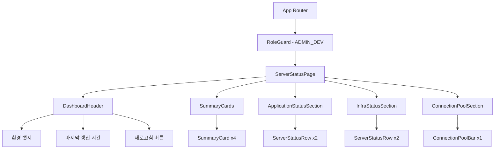
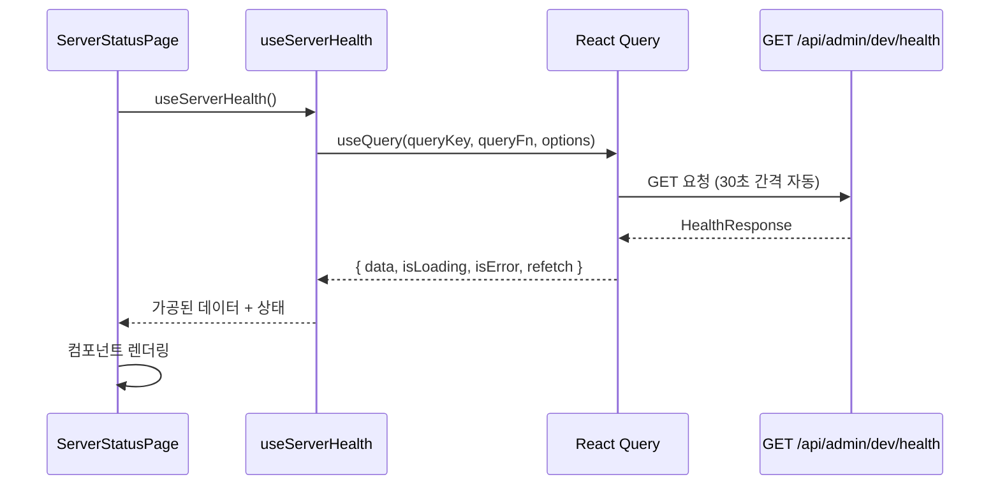

# Design Document: Server Status Dashboard

## Overview

기존 admin-front의 "API 로그" placeholder 페이지(`/api-logs`)를 "서버 상태 확인" 대시보드로 교체한다. ADMIN_DEV 역할 전용 페이지로, `GET /api/admin/dev/health` API를 통해 서버 상태를 실시간 모니터링한다.

대시보드는 4개 섹션으로 구성된다:
1. **요약 카드** — 전체 서버 수, 평균 응답시간, 지연 구간, DB 커넥션 풀 사용률
2. **애플리케이션 상태** — user_back, admin_back 서버의 헬스체크 결과
3. **인프라 상태** — MySQL, Redis 서비스의 헬스체크 결과
4. **DB 커넥션 풀 사용률** — Spring Boot 커넥션 풀 사용 현황

React Query의 `refetchInterval`(30초)을 활용한 자동 새로고침과 수동 새로고침 버튼을 제공한다.

## Architecture

### 컴포넌트 계층 구조



### 데이터 흐름



### 디렉토리 구조

```
admin-front/src/
├── api/
│   └── serverHealthApi.ts          # API 호출 함수
├── components/
│   └── server-status/
│       ├── DashboardHeader.tsx      # 페이지 헤더 (제목, 환경 뱃지, 갱신 시간, 새로고침)
│       ├── SummaryCards.tsx         # 요약 카드 4개 섹션
│       ├── SummaryCard.tsx          # 개별 요약 카드
│       ├── ApplicationStatusSection.tsx  # 애플리케이션 상태 섹션
│       ├── InfraStatusSection.tsx   # 인프라 상태 섹션
│       ├── ServerStatusRow.tsx      # 개별 서버 상태 행 (공통)
│       └── ConnectionPoolSection.tsx # DB 커넥션 풀 섹션
├── constants/
│   └── queryKeys.ts                # SERVER_HEALTH_KEYS 추가
├── hooks/
│   └── useServerHealth.ts          # 서버 상태 조회 커스텀 훅
├── pages/
│   └── server-status/
│       └── ServerStatusPage.tsx    # 페이지 컴포넌트
└── types/
    └── serverHealth.ts             # 서버 상태 관련 타입 정의
```

## Components and Interfaces

### 1. API 레이어 (`serverHealthApi.ts`)

```typescript
import axiosInstance from '@/api/axiosInstance';
import type { ServerHealthData } from '@/types/serverHealth';

/**
 * 서버 상태 데이터를 조회한다.
 * axiosInstance 인터셉터가 result를 자동 언래핑하므로
 * 반환값은 result 객체 자체이다.
 */
export async function fetchServerHealth(): Promise<ServerHealthData> {
  const { data } = await axiosInstance.get<ServerHealthData>('/api/admin/dev/health');
  return data;
}
```

### 2. 커스텀 훅 (`useServerHealth.ts`)

```typescript
import { useQuery } from '@tanstack/react-query';
import { SERVER_HEALTH_KEYS } from '@/constants/queryKeys';
import { fetchServerHealth } from '@/api/serverHealthApi';
import type { ServerHealthData } from '@/types/serverHealth';

export interface UseServerHealthReturn {
  data: ServerHealthData | undefined;
  isLoading: boolean;
  isError: boolean;
  error: Error | null;
  refetch: () => void;
  isFetching: boolean;
  dataUpdatedAt: number;
  failureCount: number;
}

/**
 * 서버 상태 데이터를 조회하는 커스텀 훅.
 * - staleTime: 30초
 * - gcTime: 5분
 * - refetchInterval: 30초 (자동 새로고침)
 */
export function useServerHealth(): UseServerHealthReturn {
  const { data, isLoading, isError, error, refetch, isFetching, dataUpdatedAt, failureCount } =
    useQuery<ServerHealthData, Error>({
      queryKey: SERVER_HEALTH_KEYS.status(),
      queryFn: fetchServerHealth,
      staleTime: 30_000,
      gcTime: 300_000,
      refetchInterval: 30_000,
    });

  return {
    data,
    isLoading,
    isError,
    error: error ?? null,
    refetch,
    isFetching,
    dataUpdatedAt,
    failureCount,
  };
}
```

### 3. Query Keys (`queryKeys.ts`에 추가)

```typescript
export const SERVER_HEALTH_KEYS = {
  all: ['server-health'] as const,
  status: () => [...SERVER_HEALTH_KEYS.all, 'status'] as const,
} as const;
```

### 4. 페이지 컴포넌트 (`ServerStatusPage.tsx`)

```typescript
/**
 * 서버 상태 확인 대시보드 페이지.
 * useServerHealth 훅으로 데이터를 조회하고,
 * 로딩/에러/정상 상태에 따라 적절한 UI를 렌더링한다.
 */
export default function ServerStatusPage() {
  const { data, isLoading, isError, refetch, isFetching, dataUpdatedAt, failureCount } =
    useServerHealth();

  if (isLoading) return <LoadingState message="서버 상태를 확인하는 중입니다" />;
  if (isError && !data) return <ErrorState onRetry={refetch} />;

  return (
    <div className="space-y-6 p-8">
      <DashboardHeader
        dataUpdatedAt={dataUpdatedAt}
        isFetching={isFetching}
        onRefresh={refetch}
        failureCount={failureCount}
      />
      <SummaryCards data={data} isLoading={isFetching && !data} />
      <div className="grid grid-cols-2 gap-6">
        <ApplicationStatusSection servers={data?.servers.applications} />
        <InfraStatusSection servers={data?.servers.infrastructure} />
      </div>
      <ConnectionPoolSection pools={data?.dbConnectionPool} />
    </div>
  );
}
```

### 5. DashboardHeader 컴포넌트

Props:
- `dataUpdatedAt: number` — 마지막 성공 시각 (timestamp)
- `isFetching: boolean` — 현재 요청 진행 중 여부
- `onRefresh: () => void` — 수동 새로고침 콜백
- `failureCount: number` — 연속 실패 횟수

기능:
- 페이지 제목 "서버 통신 상태" 표시
- `VITE_ENV_NAME` 환경변수로 환경 뱃지 표시 (예: "스테이징 환경")
- `dataUpdatedAt`을 "YYYY-MM-DD HH:mm" 형식으로 표시
- `failureCount >= 3`일 때 경고 아이콘 표시
- 새로고침 버튼: `isFetching` 중에는 스피너 + disabled 처리

### 6. SummaryCard 컴포넌트

Props:
- `icon: string` — 이모지 아이콘
- `iconBg: string` — 아이콘 배경색 클래스
- `title: string` — 카드 제목
- `value: string` — 주요 값
- `subtitle?: string` — 부가 정보

### 7. ServerStatusRow 컴포넌트

Props:
- `name: string` — 서버/서비스 이름
- `status: HealthStatus` — 서버 상태 ('UP' | 'SLOW' | 'DOWN')
- `responseMs: number` — 응답 시간 (ms)
- `lastCheckedAt: string` — 마지막 체크 시각 (ISO 8601)

기능:
- 상태 색상 결정 로직:
  - `status === 'DOWN'` → 빨강 (장애)
  - `status === 'SLOW'` → 주황 (지연)
  - `status === 'UP'` → 초록 (정상)
- 응답시간 바: `width = Math.min(responseMs / 1000, 1) * 100%`
- 상대 시간 표시: "방금 전", "1분 전" 등

### 8. ConnectionPoolSection 컴포넌트

Props:
- `pools: DbConnectionPool[] | undefined`

기능:
- 각 풀에 대해 프로그레스 바 렌더링
- 색상 결정: `< 60%` 초록, `60~84%` 주황, `>= 85%` 빨강
- 표시 형식: `{percentage}% {used}/{total}`

## Data Models

### API 응답 타입 (`types/serverHealth.ts`)

```typescript
/** 서버 상태 값 */
export type HealthStatus = 'UP' | 'SLOW' | 'DOWN';

/** 개별 서버/서비스 상태 */
export interface ServerStatus {
  /** 서버 이름 (예: "user_back", "mysql") */
  name: string;
  /** 서버 상태 */
  status: HealthStatus;
  /** 응답 시간 (밀리초) */
  responseMs: number;
  /** 마지막 체크 시각 (ISO 8601, 예: "2026-05-26T14:32:07") */
  lastCheckedAt: string;
}

/** 서버 그룹 */
export interface ServerGroup {
  /** 애플리케이션 서버 목록 */
  applications: ServerStatus[];
  /** 인프라 서비스 목록 */
  infrastructure: ServerStatus[];
}

/** DB 커넥션 풀 정보 */
export interface DbConnectionPool {
  /** 애플리케이션 이름 (예: "Spring Boot") */
  name: string;
  /** 사용 중인 커넥션 수 */
  used: number;
  /** 전체 커넥션 수 */
  total: number;
}

/** 요약 정보 */
export interface HealthSummary {
  /** 전체 서버 수 */
  totalCount: number;
  /** 정상 서버 수 */
  normalCount: number;
  /** 지연 서버 수 */
  slowCount: number;
  /** 평균 응답 시간 (밀리초) */
  averageResponseMs: number;
}

/** 서버 상태 API 전체 응답 (result 필드 내부) */
export interface ServerHealthData {
  servers: ServerGroup;
  dbConnectionPool: DbConnectionPool[];
  summary: HealthSummary;
}
```

### UI 상태 파생 유틸리티

```typescript
/** 응답시간 기반 상태 색상 결정 */
export type StatusColor = 'green' | 'orange' | 'red';

export function getStatusColor(status: HealthStatus): StatusColor {
  if (status === 'DOWN') return 'red';
  if (status === 'SLOW') return 'orange';
  return 'green';
}

/** 커넥션 풀 사용률 기반 색상 결정 */
export function getPoolColor(used: number, total: number): StatusColor {
  const percentage = total > 0 ? (used / total) * 100 : 0;
  if (percentage < 60) return 'green';
  if (percentage < 85) return 'orange';
  return 'red';
}

/** 상대 시간 포맷 (예: "방금 전", "3분 전") */
export function formatRelativeTime(isoString: string): string {
  const diff = Date.now() - new Date(isoString).getTime();
  const minutes = Math.floor(diff / 60_000);
  if (minutes < 1) return '방금 전';
  if (minutes < 60) return `${minutes}분 전`;
  return `${Math.floor(minutes / 60)}시간 전`;
}
```


## Correctness Properties

*A property is a characteristic or behavior that should hold true across all valid executions of a system-essentially, a formal statement about what the system should do. Properties serve as the bridge between human-readable specifications and machine-verifiable correctness guarantees.*

### Property 1: 타임스탬프 포맷 유효성

*For any* valid JavaScript timestamp (number), 포맷 함수는 "YYYY-MM-DD HH:mm" 패턴을 만족하는 문자열을 반환해야 한다. 즉, 반환값은 `/^\d{4}-\d{2}-\d{2} \d{2}:\d{2}$/` 정규식과 매칭되어야 한다.

**Validates: Requirements 1.3, 8.3**

### Property 2: 요약 카드 값 포맷팅

*For any* valid HealthSummary 데이터(normalCount: 0~totalCount, totalCount: 1 이상, averageResponseMs: 0 이상의 정수)와 DbConnectionPool 데이터(used: 0~total, total: 1 이상)에 대해:
- 서버 수 포맷은 `"{normalCount}/{totalCount}"` 형식이어야 한다
- 평균 응답시간 포맷은 `"{Math.round(averageResponseMs)}ms"` 형식이어야 한다
- 커넥션 풀 포맷은 `"{Math.round(used/total*100)}% {used}/{total} 사용 중"` 형식이어야 한다

**Validates: Requirements 2.2, 2.3, 2.8, 5.2**

### Property 3: 지연 구간 식별

*For any* 서버 목록에서, 지연 서버 수는 status가 'UP'이면서 responseMs가 300 이상 1000 이하인 서버의 수와 정확히 일치해야 한다. 지연 서버가 0개이면 "0"만 표시하고, 1개 이상이면 해당 서버 이름을 포함해야 한다.

**Validates: Requirements 2.6, 2.7**

### Property 4: 서버 상태 색상 결정 (getStatusColor)

*For any* HealthStatus('UP' | 'SLOW' | 'DOWN')에 대해:
- status가 'UP'이면 'green'을 반환한다
- status가 'SLOW'이면 'orange'를 반환한다
- status가 'DOWN'이면 'red'를 반환한다

**Validates: Requirements 3.3, 3.4, 3.5, 3.6, 4.4**

### Property 5: 응답시간 바 너비 계산

*For any* responseMs(0 이상의 정수)에 대해, 바 너비 비율은 `Math.min(responseMs / 1000, 1)`이어야 하며, 결과값은 항상 0 이상 1 이하여야 한다.

**Validates: Requirements 3.7**

### Property 6: 커넥션 풀 색상 결정 (getPoolColor)

*For any* used(0 이상)와 total(1 이상, used <= total)에 대해:
- (used/total)*100 < 60이면 'green'을 반환한다
- 60 <= (used/total)*100 < 85이면 'orange'를 반환한다
- (used/total)*100 >= 85이면 'red'를 반환한다

**Validates: Requirements 5.3, 5.4, 5.5**

### Property 7: 상대 시간 포맷 (formatRelativeTime)

*For any* 유효한 ISO 8601 타임스탬프에 대해, formatRelativeTime 함수는:
- 현재 시각과의 차이가 1분 미만이면 "방금 전"을 반환한다
- 1분 이상 60분 미만이면 "{n}분 전" 형식을 반환한다
- 60분 이상이면 "{n}시간 전" 형식을 반환한다
- 반환값은 항상 비어있지 않은 문자열이다

**Validates: Requirements 3.2, 4.2**

### Property 8: 연속 실패 경고 표시 조건

*For any* failureCount(0 이상의 정수)에 대해, 경고 인디케이터는 failureCount >= 3일 때만 표시되어야 한다. failureCount < 3이면 경고가 표시되지 않아야 한다.

**Validates: Requirements 8.5**

## Error Handling

### API 에러 처리 전략

| 상황 | 처리 방식 |
|------|-----------|
| 초기 로딩 실패 (네트워크 에러, 5xx) | `ErrorState` 컴포넌트 표시 + 재시도 버튼 |
| 자동 새로고침 실패 (이전 데이터 있음) | 이전 데이터 유지 + 마지막 성공 시간 표시 |
| 3회 연속 자동 새로고침 실패 | 경고 아이콘 표시 + 이전 데이터 유지 |
| 수동 새로고침 실패 | 이전 데이터 유지 + 마지막 성공 시간 유지 |
| 401 Unauthorized | axiosInstance 인터셉터에서 /login 리다이렉트 |

### React Query 에러 처리 설정

```typescript
{
  staleTime: 30_000,        // 30초 동안 fresh 상태 유지
  gcTime: 300_000,          // 5분 동안 캐시 유지
  refetchInterval: 30_000,  // 30초 자동 새로고침
  retry: 1,                 // 실패 시 1회 재시도
}
```

### 서버 상태별 에러 표시

- `status: "DOWN"` → 빨간 인디케이터 + "장애" 텍스트 (responseMs 대신)
- 데이터 없는 서비스 → 빨간 인디케이터 + "장애" 텍스트

## Testing Strategy

### 단위 테스트 (Vitest + React Testing Library)

| 대상 | 테스트 내용 |
|------|-------------|
| `getStatusColor` | 각 구간별 올바른 색상 반환 |
| `getPoolColor` | 각 구간별 올바른 색상 반환 |
| `formatRelativeTime` | 시간 차이별 올바른 문자열 반환 |
| `formatDateTime` | 타임스탬프 → "YYYY-MM-DD HH:mm" 변환 |
| `ServerStatusRow` | 서버 데이터 렌더링 완전성 |
| `SummaryCards` | 요약 데이터 포맷 및 표시 |
| `ConnectionPoolSection` | 프로그레스 바 색상 및 값 표시 |
| `DashboardHeader` | 환경 뱃지, 시간, 새로고침 버튼 동작 |
| `ServerStatusPage` | 로딩/에러/정상 상태 전환 |

### Property-Based 테스트 (fast-check)

프로젝트에 이미 `fast-check` 라이브러리가 설치되어 있으므로 이를 활용한다.

| Property | 테스트 대상 | 최소 반복 |
|----------|-------------|-----------|
| Property 1 | `formatDateTime` 함수 | 100회 |
| Property 2 | 요약 카드 포맷 함수들 | 100회 |
| Property 3 | 지연 구간 식별 로직 | 100회 |
| Property 4 | `getStatusColor` 함수 | 100회 |
| Property 5 | 바 너비 계산 로직 | 100회 |
| Property 6 | `getPoolColor` 함수 | 100회 |
| Property 7 | `formatRelativeTime` 함수 | 100회 |
| Property 8 | 경고 표시 조건 로직 | 100회 |

각 property 테스트는 다음 태그 형식으로 주석을 포함한다:
```
// Feature: server-status-dashboard, Property {number}: {property_text}
```

### 통합 테스트

| 대상 | 테스트 내용 |
|------|-------------|
| `ServerStatusPage` + `useServerHealth` | API 모킹 후 전체 페이지 렌더링 흐름 |
| 자동 새로고침 | `refetchInterval` 동작 확인 (fake timers) |
| 에러 → 재시도 → 성공 | 에러 상태에서 재시도 후 정상 복원 |
| RoleGuard 통합 | ADMIN_DEV 외 역할 접근 차단 |
