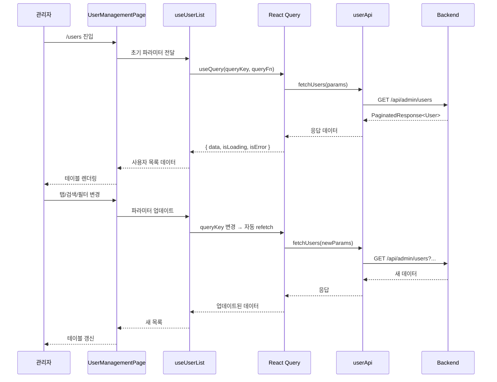

# Design Document: 사용자 관리 (User Management)

## Overview

사용자 관리 페이지는 admin-front 앱에서 DEV_ADMIN 권한을 가진 관리자가 시스템에 등록된 모든 사용자(관리자, 은행원, 고객)를 조회, 검색, 필터링하고 관리할 수 있는 페이지입니다.

### 주요 기능
- 사용자 통계 카드 (전체/권한별/비활성 사용자 수)
- 탭 기반 필터 네비게이션 (전체, 관리자, 은행원, 고객, 비활성)
- 검색 및 드롭다운 필터 (이름/아이디/이메일, 권한, 상태, 소속)
- 사용자 데이터 테이블 (페이지네이션 포함)
- 엑셀 다운로드 및 사용자 등록 액션
- 권한 뱃지 및 상태 인디케이터
- React Query 기반 서버 상태 관리
- RoleGuard 기반 접근 권한 제어

### 설계 원칙
- 기존 프로젝트 패턴(api/, hooks/, components/, pages/) 준수
- 공통 컴포넌트(DataTable, LoadingState, ErrorState, StatusBadge, RoleGuard) 재사용
- React Query를 통한 서버 상태 관리 일관성 유지
- 공통 axiosInstance를 통한 API 호출

## Architecture

```mermaid
graph TD
    subgraph Pages
        UMP[UserManagementPage]
    end

    subgraph Components
        SC[StatisticsCards]
        UT[UserTabs]
        SF[SearchFilter]
        UTB[UserTable]
        RB[RoleBadge]
        SI[StatusIndicator]
        PG[Pagination]
        AB[ActionButtons]
    end

    subgraph Hooks
        UUL[useUserList]
        UUS[useUserStatistics]
        UUD[useUserDownload]
    end

    subgraph API
        UA[userApi.ts]
    end

    subgraph Common
        DT[DataTable]
        LS[LoadingState]
        ES[ErrorState]
        RG[RoleGuard]
    end

    UMP --> SC
    UMP --> UT
    UMP --> SF
    UMP --> UTB
    UMP --> AB
    UMP --> PG

    UTB --> RB
    UTB --> SI
    UTB --> DT

    UMP --> UUL
    UMP --> UUS
    UMP --> UUD

    UUL --> UA
    UUS --> UA
    UUD --> UA

    UA --> AI[axiosInstance]
end
```

### 데이터 흐름



## Components and Interfaces

### 페이지 컴포넌트

#### `UserManagementPage`
- 경로: `src/pages/user-management/UserManagementPage.tsx`
- 역할: 사용자 관리 페이지의 최상위 컨테이너
- 상태 관리: 탭, 검색어, 필터, 페이지네이션 상태를 로컬 state로 관리
- 하위 컴포넌트 조합 및 데이터 흐름 조율

### 도메인 컴포넌트

#### `StatisticsCards`
- 경로: `src/components/user-management/StatisticsCards.tsx`
- Props: `{ data?: UserStatistics; isLoading: boolean; isError: boolean; onRetry: () => void }`
- 역할: 5개 통계 카드(전체, 관리자, 은행원, 고객, 비활성) 렌더링

#### `UserTabs`
- 경로: `src/components/user-management/UserTabs.tsx`
- Props: `{ activeTab: UserTab; onTabChange: (tab: UserTab) => void }`
- 역할: 5개 탭 네비게이션 렌더링 및 활성 탭 강조

#### `SearchFilter`
- 경로: `src/components/user-management/SearchFilter.tsx`
- Props: `{ filters: UserFilters; onFiltersChange: (filters: UserFilters) => void; departments: string[] }`
- 역할: 검색 입력 필드 + 3개 드롭다운 필터 렌더링
- 내부 동작: 300ms 디바운스 적용

#### `UserTable`
- 경로: `src/components/user-management/UserTable.tsx`
- Props: `{ data: UserListItem[]; totalCount: number; currentPage: number; pageSize: number }`
- 역할: 공통 DataTable을 활용한 사용자 목록 테이블 렌더링

#### `RoleBadge`
- 경로: `src/components/user-management/RoleBadge.tsx`
- Props: `{ role: string }`
- 역할: 권한별 색상 뱃지 렌더링 (파란색/초록색/주황색/회색)

#### `StatusIndicator`
- 경로: `src/components/user-management/StatusIndicator.tsx`
- Props: `{ status: string }`
- 역할: 활성/비활성 상태 도트 + 텍스트 렌더링

#### `Pagination`
- 경로: `src/components/user-management/Pagination.tsx`
- Props: `{ currentPage: number; totalPages: number; pageSize: number; onPageChange: (page: number) => void; onPageSizeChange: (size: number) => void }`
- 역할: 페이지 네비게이션 및 페이지당 건수 선택

#### `ActionButtons`
- 경로: `src/components/user-management/ActionButtons.tsx`
- Props: `{ onExcelDownload: () => void; onRegisterUser: () => void; isDownloading: boolean; isDisabled: boolean }`
- 역할: 엑셀 다운로드 및 사용자 등록 버튼 렌더링

### 커스텀 훅

#### `useUserList`
- 경로: `src/hooks/useUserList.ts`
- 파라미터: `UserListParams` (탭, 검색어, 필터, 페이지, 사이즈)
- 반환: `{ data, isLoading, isError, error, refetch }`
- 쿼리 키: `USER_KEYS.list()` + params
- staleTime: 30,000ms
- retry: 3

#### `useUserStatistics`
- 경로: `src/hooks/useUserStatistics.ts`
- 반환: `{ data, isLoading, isError, refetch }`
- 쿼리 키: `USER_KEYS.statistics()`
- staleTime: 30,000ms

#### `useUserDownload`
- 경로: `src/hooks/useUserDownload.ts`
- 반환: `{ download, isDownloading, error }`
- useMutation 기반 엑셀 다운로드 처리

### API 모듈

#### `userApi.ts`
- 경로: `src/api/userApi.ts`
- 함수:
  - `fetchUsers(params: UserListParams): Promise<PaginatedUserResponse>`
  - `fetchUserStatistics(): Promise<UserStatistics>`
  - `downloadUsersExcel(params: UserDownloadParams): Promise<Blob>`
  - `fetchDepartments(): Promise<string[]>`

### 쿼리 키 확장

```typescript
// src/constants/queryKeys.ts에 추가
export const USER_KEYS = {
  all: ['users'] as const,
  list: () => [...USER_KEYS.all, 'list'] as const,
  statistics: () => [...USER_KEYS.all, 'statistics'] as const,
  departments: () => [...USER_KEYS.all, 'departments'] as const,
} as const;
```

## Data Models

### API 요청/응답 타입

```typescript
/** 사용자 역할 (관리자 포함 전체) */
export type UserRole = 'ADMIN_DEV' | 'ADMIN_BANK_TELLER' | 'ADMIN_BANK_MANAGER' | 'USER';

/** 사용자 상태 */
export type UserStatus = 'ACTIVE' | 'INACTIVE';

/** 탭 필터 타입 */
export type UserTab = 'all' | 'admin' | 'banker' | 'customer' | 'inactive';

/** 사용자 목록 조회 파라미터 */
export interface UserListParams {
  page: number;
  size: number;
  tab: UserTab;
  keyword?: string;
  role?: UserRole;
  status?: UserStatus;
  department?: string;
}

/** 사용자 목록 항목 */
export interface UserListItem {
  id: number;
  loginId: string;
  name: string;
  email: string;
  role: UserRole;
  department: string | null;
  status: UserStatus;
  lastLoginAt: string | null;
}

/** 사용자 목록 페이징 응답 */
export interface PaginatedUserResponse {
  users: UserListItem[];
  totalCount: number;
  totalPages: number;
  currentPage: number;
  size: number;
}

/** 사용자 통계 데이터 */
export interface UserStatistics {
  totalCount: number;
  activeCount: number;
  adminCount: number;
  bankerCount: number;
  customerCount: number;
  inactiveCount: number;
}

/** 검색/필터 상태 */
export interface UserFilters {
  keyword: string;
  role: UserRole | '';
  status: UserStatus | '';
  department: string;
}

/** 엑셀 다운로드 파라미터 */
export interface UserDownloadParams {
  tab: UserTab;
  keyword?: string;
  role?: UserRole;
  status?: UserStatus;
  department?: string;
}
```

### 상태 관리 구조

페이지 로컬 상태 (useState):
- `activeTab: UserTab` — 현재 활성 탭
- `filters: UserFilters` — 검색어 + 드롭다운 필터
- `currentPage: number` — 현재 페이지 번호
- `pageSize: number` — 페이지당 표시 건수

서버 상태 (React Query):
- 사용자 목록: `useQuery` with `USER_KEYS.list()` + params
- 통계 데이터: `useQuery` with `USER_KEYS.statistics()`
- 소속 목록: `useQuery` with `USER_KEYS.departments()`
- 엑셀 다운로드: `useMutation`


## Correctness Properties

*A property is a characteristic or behavior that should hold true across all valid executions of a system—essentially, a formal statement about what the system should do. Properties serve as the bridge between human-readable specifications and machine-verifiable correctness guarantees.*

### Property 1: 비율 계산 정확성

*For any* 부분 카운트(partCount)와 전체 카운트(totalCount)에 대해, 비율 계산 함수는 totalCount가 0이면 "0.00%"를 반환하고, totalCount가 0보다 크면 `(partCount / totalCount * 100).toFixed(2) + "%"` 형식의 문자열을 반환해야 한다.

**Validates: Requirements 2.3, 2.4, 2.5, 2.6, 2.7**

### Property 2: 필터 변경 시 페이지 초기화

*For any* 탭 변경, 검색어 변경, 드롭다운 필터 변경, 또는 페이지당 건수 변경 이벤트에 대해, 현재 페이지 번호는 반드시 1로 초기화되어야 한다.

**Validates: Requirements 3.8, 4.8, 9.5**

### Property 3: 역할 뱃지 매핑

*For any* 역할 문자열에 대해, RoleBadge 컴포넌트는 ADMIN_DEV이면 파란색 배경 + "관리자" 텍스트를, ADMIN_BANK_TELLER 또는 ADMIN_BANK_MANAGER이면 초록색 배경 + "은행원" 텍스트를, USER이면 주황색 배경 + "고객" 텍스트를, 그 외 문자열이면 회색 배경 + 원본 텍스트를 반환해야 한다.

**Validates: Requirements 7.1, 7.2, 7.3, 7.4**

### Property 4: 상태 인디케이터 매핑

*For any* 상태 문자열에 대해, StatusIndicator 컴포넌트는 ACTIVE이면 초록색 도트 + "활성" 텍스트를, INACTIVE이면 빨간색 도트 + "비활성" 텍스트를, 그 외 문자열이면 회색 도트 + 원본 텍스트를 반환해야 한다.

**Validates: Requirements 8.1, 8.2, 8.3**

### Property 5: 검색어 길이 기반 검색 트리거 판정

*For any* 문자열 입력에 대해, 검색 트리거 판정 함수는 문자열 길이가 2 이상이면 true(검색 실행)를, 2 미만이면 false(검색 해제)를 반환해야 한다.

**Validates: Requirements 4.5, 4.6**

### Property 6: 필터 조합 → API 파라미터 구성

*For any* 유효한 탭(UserTab), 검색어(keyword), 역할 필터(role), 상태 필터(status), 소속 필터(department) 조합에 대해, API 파라미터 빌더 함수는 모든 비어있지 않은 필터 값을 AND 조합으로 포함하는 UserListParams 객체를 반환해야 한다.

**Validates: Requirements 4.7, 11.5**

### Property 7: 테이블 순번 계산

*For any* 유효한 totalCount(≥0), currentPage(≥1), pageSize(≥1), rowIndex(≥0)에 대해, 순번 계산 함수는 `totalCount - ((currentPage - 1) × pageSize + rowIndex)` 값을 반환해야 하며, 이 값은 항상 양수이거나 0이어야 한다.

**Validates: Requirements 6.4**

### Property 8: 날짜 포맷팅

*For any* 유효한 ISO 8601 날짜 문자열에 대해, 날짜 포맷 함수는 "YYYY.MM.DD HH:mm" 형식의 문자열을 반환해야 하며, null 입력에 대해서는 "-"를 반환해야 한다.

**Validates: Requirements 6.5, 6.6**

### Property 9: 페이지 번호 생성

*For any* 유효한 totalPages(≥1)와 currentPage(1 ≤ currentPage ≤ totalPages)에 대해, 페이지 번호 생성 함수는 최대 5개의 페이지 번호를 포함하는 배열을 반환해야 하며, currentPage는 반드시 배열에 포함되어야 하고, 생략된 범위가 있으면 말줄임표 마커가 포함되어야 한다.

**Validates: Requirements 9.7**

## Error Handling

### API 에러 처리 전략

| 에러 유형 | 처리 방식 | UI 표현 |
|-----------|-----------|---------|
| 401 Unauthorized | axiosInstance 인터셉터에서 `/login` 리다이렉트 | 자동 리다이렉트 |
| 403 Forbidden | RoleGuard에서 ForbiddenPage 렌더링 | 권한 없음 안내 페이지 |
| 네트워크 에러 | React Query retry 3회 후 isError=true | ErrorState + "다시 시도" 버튼 |
| 서버 에러 (5xx) | React Query retry 3회 후 isError=true | ErrorState + 에러 메시지 |
| 통계 API 실패 | 통계 카드 영역에 에러 표시 | 에러 메시지 + 재시도 버튼 |
| 엑셀 다운로드 실패 | useMutation onError 콜백 | 버튼 복원 + 에러 토스트 |

### 에러 상태 분리

- **사용자 목록 에러**: 테이블 영역만 ErrorState로 대체. 헤더, 통계 카드, 탭은 유지.
- **통계 데이터 에러**: 통계 카드 영역만 에러 표시. 테이블은 독립적으로 동작.
- **소속 목록 에러**: 소속 드롭다운을 "전체"만 표시. 다른 기능에 영향 없음.

### 빈 상태 처리

- 필터 결과 0건: "조회된 사용자가 없습니다." 메시지 (에러가 아닌 빈 상태)
- 페이지네이션: 0건일 때 페이지 번호 미표시, 네비게이션 버튼 전체 비활성화

## Testing Strategy

### 단위 테스트 (Vitest + React Testing Library)

**순수 함수 테스트:**
- `calculatePercentage(part, total)` — 비율 계산
- `calculateRowNumber(totalCount, currentPage, pageSize, rowIndex)` — 순번 계산
- `formatLastLogin(dateString | null)` — 날짜 포맷팅
- `generatePageNumbers(totalPages, currentPage)` — 페이지 번호 생성
- `buildUserListParams(tab, filters, page, size)` — API 파라미터 빌드
- `shouldTriggerSearch(keyword)` — 검색 트리거 판정
- `getRoleBadgeConfig(role)` — 역할 뱃지 설정 반환
- `getStatusIndicatorConfig(status)` — 상태 인디케이터 설정 반환

**컴포넌트 테스트:**
- StatisticsCards: 로딩/에러/데이터 상태별 렌더링
- UserTabs: 탭 클릭 이벤트 및 활성 상태
- SearchFilter: 디바운스 동작, 필터 변경 이벤트
- Pagination: 페이지 변경, 건수 변경, 비활성화 조건
- RoleBadge: 역할별 색상 및 텍스트
- StatusIndicator: 상태별 색상 및 텍스트

### Property-Based 테스트 (fast-check)

프로젝트에 이미 `fast-check` 라이브러리가 설치되어 있으므로 이를 활용합니다.

**설정:**
- 최소 100회 반복 실행
- 각 테스트에 설계 문서 속성 참조 태그 포함
- 태그 형식: `Feature: user-management, Property {number}: {property_text}`

**대상 속성:**
- Property 1: 비율 계산 (calculatePercentage)
- Property 3: 역할 뱃지 매핑 (getRoleBadgeConfig)
- Property 4: 상태 인디케이터 매핑 (getStatusIndicatorConfig)
- Property 5: 검색 트리거 판정 (shouldTriggerSearch)
- Property 6: 필터 조합 파라미터 구성 (buildUserListParams)
- Property 7: 순번 계산 (calculateRowNumber)
- Property 8: 날짜 포맷팅 (formatLastLogin)
- Property 9: 페이지 번호 생성 (generatePageNumbers)

### 통합 테스트

- API 호출 mock을 통한 훅 동작 검증 (useUserList, useUserStatistics)
- 페이지 전체 렌더링 및 사용자 인터랙션 시나리오
- RoleGuard 접근 제어 동작 검증
